# 软件实践碎碎念 - 2020

----------------------------------------

<!-- START doctoc generated TOC please keep comment here to allow auto update -->
<!-- DON'T EDIT THIS SECTION, INSTEAD RE-RUN doctoc TO UPDATE -->

- [《架构设计分享》听的记录&感想 - 2020-12-31](#%E6%9E%B6%E6%9E%84%E8%AE%BE%E8%AE%A1%E5%88%86%E4%BA%AB%E5%90%AC%E7%9A%84%E8%AE%B0%E5%BD%95%E6%84%9F%E6%83%B3---2020-12-31)
    - [大家的讨论](#%E5%A4%A7%E5%AE%B6%E7%9A%84%E8%AE%A8%E8%AE%BA)
- [面向业务价值的流管及其演进 - 2020-12-29](#%E9%9D%A2%E5%90%91%E4%B8%9A%E5%8A%A1%E4%BB%B7%E5%80%BC%E7%9A%84%E6%B5%81%E7%AE%A1%E5%8F%8A%E5%85%B6%E6%BC%94%E8%BF%9B---2020-12-29)
    - [大家的讨论](#%E5%A4%A7%E5%AE%B6%E7%9A%84%E8%AE%A8%E8%AE%BA-1)
- [深度/底层优化 - 2020-12-25](#%E6%B7%B1%E5%BA%A6%E5%BA%95%E5%B1%82%E4%BC%98%E5%8C%96---2020-12-25)
- [发展与文化 - 2020-12-24](#%E5%8F%91%E5%B1%95%E4%B8%8E%E6%96%87%E5%8C%96---2020-12-24)
- [软件工程基本定理（the Fundamental Theorem of Software Engineering/`FTSE`）、间接层 - 2020-12-13](#%E8%BD%AF%E4%BB%B6%E5%B7%A5%E7%A8%8B%E5%9F%BA%E6%9C%AC%E5%AE%9A%E7%90%86the-fundamental-theorem-of-software-engineeringftse%E9%97%B4%E6%8E%A5%E5%B1%82---2020-12-13)
- [数据分析思维 - 2020-12-11](#%E6%95%B0%E6%8D%AE%E5%88%86%E6%9E%90%E6%80%9D%E7%BB%B4---2020-12-11)
- [代码是负债，越少越好！解决用户问题的系统才是资产！ - 2020-11-20](#%E4%BB%A3%E7%A0%81%E6%98%AF%E8%B4%9F%E5%80%BA%E8%B6%8A%E5%B0%91%E8%B6%8A%E5%A5%BD%E8%A7%A3%E5%86%B3%E7%94%A8%E6%88%B7%E9%97%AE%E9%A2%98%E7%9A%84%E7%B3%BB%E7%BB%9F%E6%89%8D%E6%98%AF%E8%B5%84%E4%BA%A7---2020-11-20)
- [伟大的库 - 2020-11-05](#%E4%BC%9F%E5%A4%A7%E7%9A%84%E5%BA%93---2020-11-05)
- [表达与咨询 - 2020-10-30](#%E8%A1%A8%E8%BE%BE%E4%B8%8E%E5%92%A8%E8%AF%A2---2020-10-30)
- [单位引起的故障及其应对实践 - 2020-10-29](#%E5%8D%95%E4%BD%8D%E5%BC%95%E8%B5%B7%E7%9A%84%E6%95%85%E9%9A%9C%E5%8F%8A%E5%85%B6%E5%BA%94%E5%AF%B9%E5%AE%9E%E8%B7%B5---2020-10-29)
- [你又在滥用继承！继承不是为了复用代码，而为了被复用 - 2020-10-20](#%E4%BD%A0%E5%8F%88%E5%9C%A8%E6%BB%A5%E7%94%A8%E7%BB%A7%E6%89%BF%E7%BB%A7%E6%89%BF%E4%B8%8D%E6%98%AF%E4%B8%BA%E4%BA%86%E5%A4%8D%E7%94%A8%E4%BB%A3%E7%A0%81%E8%80%8C%E4%B8%BA%E4%BA%86%E8%A2%AB%E5%A4%8D%E7%94%A8---2020-10-20)
- [`ConcurrentMap`/`ConcurrentHashMap`的`computeIfAbsent`只执行一次吗？ - 2020-10-12](#concurrentmapconcurrenthashmap%E7%9A%84computeifabsent%E5%8F%AA%E6%89%A7%E8%A1%8C%E4%B8%80%E6%AC%A1%E5%90%97---2020-10-12)
- [面向对象/过程化程序设计、依赖策略 - 2020-10-10](#%E9%9D%A2%E5%90%91%E5%AF%B9%E8%B1%A1%E8%BF%87%E7%A8%8B%E5%8C%96%E7%A8%8B%E5%BA%8F%E8%AE%BE%E8%AE%A1%E4%BE%9D%E8%B5%96%E7%AD%96%E7%95%A5---2020-10-10)
- [Statistical Thinking - 2020-09-16](#statistical-thinking---2020-09-16)
- [近义多个的概念名 - 2020-09-08](#%E8%BF%91%E4%B9%89%E5%A4%9A%E4%B8%AA%E7%9A%84%E6%A6%82%E5%BF%B5%E5%90%8D---2020-09-08)
    - [大家的讨论](#%E5%A4%A7%E5%AE%B6%E7%9A%84%E8%AE%A8%E8%AE%BA-2)
- [整洁的架构/编程范式 - 2020-08-28](#%E6%95%B4%E6%B4%81%E7%9A%84%E6%9E%B6%E6%9E%84%E7%BC%96%E7%A8%8B%E8%8C%83%E5%BC%8F---2020-08-28)
- [并发 - 2020-08-28](#%E5%B9%B6%E5%8F%91---2020-08-28)
    - [大家的讨论](#%E5%A4%A7%E5%AE%B6%E7%9A%84%E8%AE%A8%E8%AE%BA-3)
- [软件设计书籍 - 2020-08-19](#%E8%BD%AF%E4%BB%B6%E8%AE%BE%E8%AE%A1%E4%B9%A6%E7%B1%8D---2020-08-19)
- [模块形状（深/高瘦程度）作为抽象/系统设计/建模的好坏的判断 - 2020-08-07](#%E6%A8%A1%E5%9D%97%E5%BD%A2%E7%8A%B6%E6%B7%B1%E9%AB%98%E7%98%A6%E7%A8%8B%E5%BA%A6%E4%BD%9C%E4%B8%BA%E6%8A%BD%E8%B1%A1%E7%B3%BB%E7%BB%9F%E8%AE%BE%E8%AE%A1%E5%BB%BA%E6%A8%A1%E7%9A%84%E5%A5%BD%E5%9D%8F%E7%9A%84%E5%88%A4%E6%96%AD---2020-08-07)
- [Unknown is Unknown! - 2020-08-24](#unknown-is-unknown---2020-08-24)
- [Reactive programming: lessons learned - 2020-06-01](#reactive-programming-lessons-learned---2020-06-01)
- [每当我想放弃 Scala，我就写写 Python 和 Java - 2020-05-08](#%E6%AF%8F%E5%BD%93%E6%88%91%E6%83%B3%E6%94%BE%E5%BC%83-scala%E6%88%91%E5%B0%B1%E5%86%99%E5%86%99-python-%E5%92%8C-java---2020-05-08)
    - [大家的讨论](#%E5%A4%A7%E5%AE%B6%E7%9A%84%E8%AE%A8%E8%AE%BA-4)
- [业务价值体感化的套路模式 - 2020-05-02](#%E4%B8%9A%E5%8A%A1%E4%BB%B7%E5%80%BC%E4%BD%93%E6%84%9F%E5%8C%96%E7%9A%84%E5%A5%97%E8%B7%AF%E6%A8%A1%E5%BC%8F---2020-05-02)
- [基础设计理念的持续滚动成为代差 - 2020-05-01](#%E5%9F%BA%E7%A1%80%E8%AE%BE%E8%AE%A1%E7%90%86%E5%BF%B5%E7%9A%84%E6%8C%81%E7%BB%AD%E6%BB%9A%E5%8A%A8%E6%88%90%E4%B8%BA%E4%BB%A3%E5%B7%AE---2020-05-01)
- [事实和观点 - 2020-04-30](#%E4%BA%8B%E5%AE%9E%E5%92%8C%E8%A7%82%E7%82%B9---2020-04-30)
- [Lombok与语法糖 - 2020-04-28](#lombok%E4%B8%8E%E8%AF%AD%E6%B3%95%E7%B3%96---2020-04-28)
- [《程序员修炼之道》 - 2020-04-16](#%E7%A8%8B%E5%BA%8F%E5%91%98%E4%BF%AE%E7%82%BC%E4%B9%8B%E9%81%93---2020-04-16)
- [代码设计 - 2020-04-16](#%E4%BB%A3%E7%A0%81%E8%AE%BE%E8%AE%A1---2020-04-16)

<!-- END doctoc generated TOC please keep comment here to allow auto update -->

----------------------------------------

## 《架构设计分享》听的记录&感想 - 2020-12-31

1. 详情是商品？灯、商品vs详情页
    * 关于 虚拟与透明
    * 关于 抽象（关注、选择的特征）
    * 关于 内涵、外延
2. 分类原则，平时我个人常常说成 维度，
    * 如policy。因为发现出现在多层中而表达混乱时，是因为有一个需要关注的一维度没有显式表达出来
    - 维度不够（分析的信息丢失不足）
3. 分层 与 分治
    * 推荐 《恰如其分的软件架构：风险驱动的设计方法》第13章 模型关系  
      https://book.douban.com/subject/24872314/
4. 设计模式 会去套模式，自然长出来
    * 问题出发，而不是手段（可套用的设计模式）。
    * 设计模式是对 解决手段 的 统一表达，为了高效交流
5. 交流、元概念
    * 元概念 往往不定义 或说
        - 表述内涵极困难
        - 前期表述出来也没有 指导（因为过抽象）
        - 但大家在脑子里会有直觉感受
    * 用如xxx、yyy举例的方式来表述 就方便、节省时间，即用
    * 大家真理解/琢磨/实战之后 再给定义描述内涵，这时又觉得精髓有有用了
    * 如何高效的讨论交流，tip 1：
      前期时、对入门者，不要讨论元概念的定义/内涵

----------------------------------------

- 关于 虚拟与透明：
    - 无中生有 是 虚拟
    - 有而无视 是 透明
- 恰如其分的软件架构 https://book.douban.com/subject/24872314/
    - 第13章 模型关系 讲了概念（模型中的 Node）间的N种关系（模型中的连线），（较meta的内容）。
    - 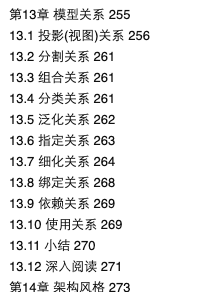
- 逻辑学中「外延」与「内涵」是什么意思？ https://www.zhihu.com/answer/83324512

### 大家的讨论

- Mr. G
    - 另外一个重要的点是：架构要讲人话，尽量用约定俗成的概念，少造概念
        - Reply By `@oldratlee`：
            - 如无必要，优先用大家平时的用语/概念名
            - 直到不行、有缺陷、概念不够用时，造新
    - 用词要仔细推敲，影响是巨大的

## 面向业务价值的流管及其演进 - 2020-12-29

Posted by Mr. L

马克尼(`MARCONI`)解决了多年来的`GraphQL`的难题，按照业务标识/身份等管控粒度分级限流。 
最近有不少人在问，之前的解决办法提供多个TQL- MTOP接口，采取高中低业务分级 哈。

### 大家的讨论

- Reply By `@oldratlee`：
    1. 从做`reactive` 演进到 高可用/自适应限流`Noah` （即reactive回压、技术架构的流控）
    2. 再到 `marconi`（面向业务价值的流量管控：业务标识管理、服务分级、面向业务架构）
    3. Marconi进一步上跳演进 应该是，业务线（如淘宝）的产品迭代试错（不是一个功能的上线）、即泳道
       - 相信这个是现在的痛点、也是后面很长一段时间的结构性问题，相信Marconi是其中的关键主导。
- [`@hepin1989`](https://github.com/hepin1989)：
    - 在系统资源有限，而“系统的用户”存在不确定性行为的情况下，就需要马可尼。
- Mr. L
    - 『description：给人看的说明』，有个性的文档
    - 『给人看』这个词有点趣味性，好比小米手机给屌丝用的？
        - Reply By `@oldratlee`：
            - 文档这句 来源于设计问题的讨论：
                - id 不要有 string信息，int 就好？（系统内部运转用的、方便简单、唯一）
                - 如果 意图是『给人看的』，编码到 description 就好了
            - 讨论思辨了1个小时，达成共识
- [`@hepin1989`](https://github.com/hepin1989)：
    - 韩国人在一生中无法避免的三个东西：死亡、纳税和三星。
    - 希望我们基础软件也可以做到这种水平。
    - Reply By `@oldratlee`：
        - 有三样东西是不能隐藏的：咳嗽、贫穷和爱。
        - PS: 「有三样东西是不能隐藏的：咳嗽、贫穷和爱」这句话的出处是哪里？
https://www.zhihu.com/question/20779304
    - Mr. K
        - 人有三样东西是无法隐瞒的，咳嗽，穷困和爱，你想隐瞒越欲盖弥彰。
        - 人有三样东西是不该挥霍的，身体，金钱和爱，你想挥霍却得不偿失。
        - 人有三样东西是无法挽留的，时间，生命和爱，你想挽留却渐行渐远。
        - 人有三样东西是不该回忆的，灾难，死亡和爱，你想回忆却苦不堪言。
        - ——《洛丽塔》
        - Reply By `@oldratlee`：
            - 爱 是个 变色龙啊。
        - Reply By Mr. L：
           - 人有一样的东西人人都有，那是 爱。

## 深度/底层优化 - 2020-12-25

> ScyllaDB 是用 C++ 重写的 Cassandra，每节点每秒处理 100 万 TPS。ScyllaDB 完全兼容 Apache Cassandra，拥有比 Cassandra 多 10x 倍的吞吐量，降低了延迟。  
> https://baike.baidu.com/item/ScyllaDB/18705315
>
> - https://github.com/scylladb/scylla
> - https://github.com/scylladb/seastar

`ScyllaDB`及其团队的深度/底层优化很有影响力

## 发展与文化 - 2020-12-24

> 陆奇最新演讲：2020，被加速的4大趋势
> https://mp.weixin.qq.com/s/d4354YNYQTgA_HqTWFaBwg

分享一篇文章，从创业的视角看现在和未来的发展趋势和应对的一些方法论，视角挺宏大的，不创业看了也是有一些帮助。

----------------------------------------

> 奈飞文化手册  
> https://book.douban.com/subject/30356081/
>
> 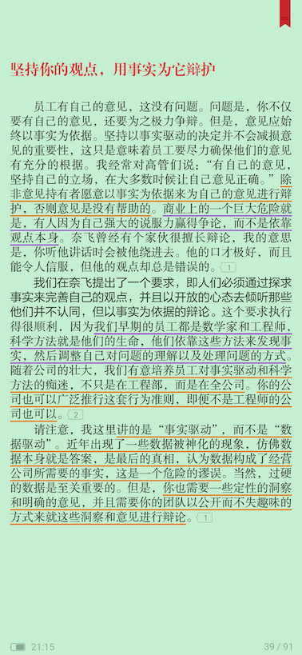
>
> 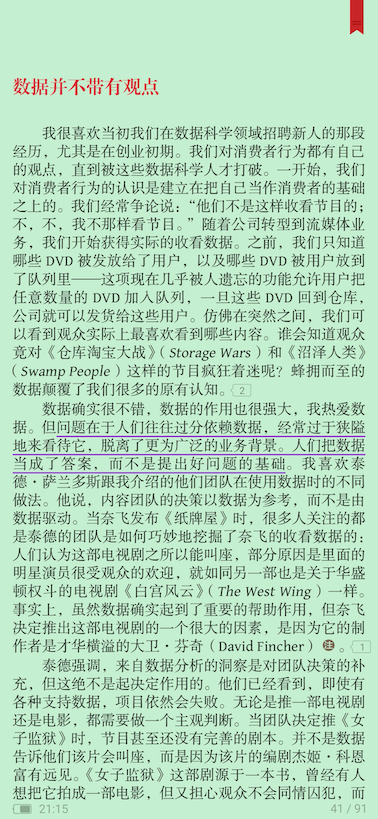
>
> 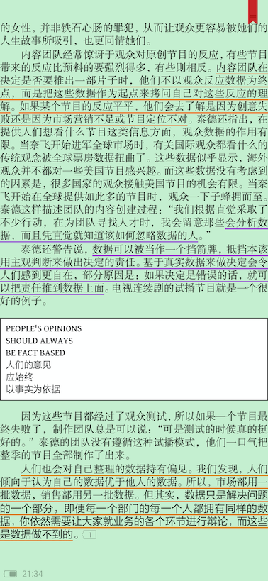
>
> 人们也会对自己整理的数据持有偏见。我们发现，人们倾向于认为自己的数据优于他人的数据。  
> 但其实，数据只是解决问题的一个部分，即便每一个部门的每一个人都拥有同样的数据，你依然需要让大家就业务的各个环节进行辩论，而这些是数据做不到的。

- HR主题的书，看看这些内容 不HR的样子
- 科学 方法论/方式 再怎么多说 都不为过；虽然 听听觉得老生常谈，想想觉得还是这理。
- 数据 通过人（选择、表达），便不再只是数据（不中立、偏向化了）

## 软件工程基本定理（the Fundamental Theorem of Software Engineering/`FTSE`）、间接层 - 2020-12-13

**软件工程基本定理**（the Fundamental Theorem of Software Engineering/**`FTSE`**）v2：

> 所有计算机科学问题，都可以通过引入一个新的间接层次来解决，那些已有过多间接层次的问题除外。  
> — David J. Wheeler （《C++程序设计语言 第4版》 前言）
>
> 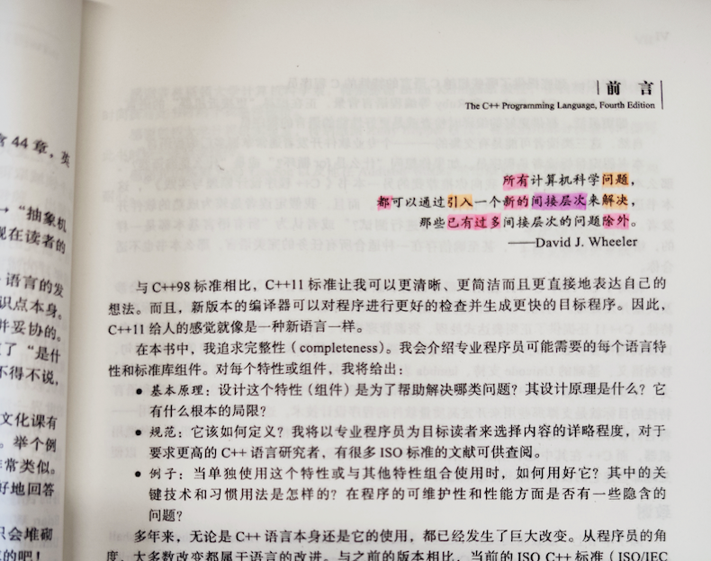

**`FTSE`** v1:

> 我们可以通过引入一个额外的间接层来解决任何问题。  
> — Butler Lampson（《C++模板元编程》2.1.2）
>
> 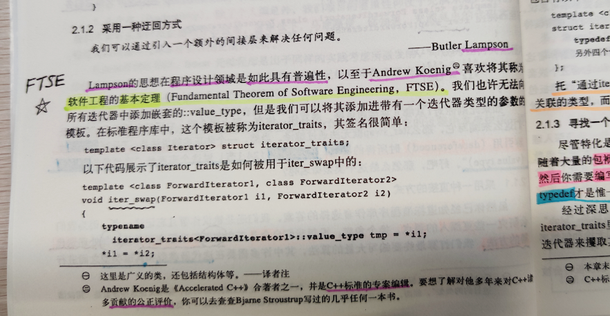

**`FTSE`** v2 = **`FTSE`** v1 ∧ 没有银弹公理（《人月神话》）。

----------------------------------------

内容也发到了[微博](https://weibo.com/1836334682/JyhDF4AIQ)上。

讨论：

- 要保有 抽象概念设计/自己独立概念 aka. 间接层
- 如何保有抽象/间接/系统设计弹性，且让其低成本（理解、实现、修改） 是 软件工程的艺术、难点。
- 需求泛化过程（即产品系统化的过程），自己与外部不一致的认知/问题会明显。
    - 即 出现一个之前没在意的合理用例/需求时，当前系统 需求不可解 & 要做基础概念（即模型）的调整重构。

PS：

- [**算术基本定理**](https://baike.baidu.com/item/%E7%AE%97%E6%9C%AF%E5%9F%BA%E6%9C%AC%E5%AE%9A%E7%90%86/10920095)：
    - 任何一个大于1的自然数N，如果N不为质数，那么N可以唯一分解成有限个质数的乘积。
- [**代数基本定理**](https://baike.baidu.com/item/%E4%BB%A3%E6%95%B0%E5%9F%BA%E6%9C%AC%E5%AE%9A%E7%90%86/18104)：
    - 任何复系数一元n次多项式 方程在复数域上至少有一根(n≥1)，由此推出，n次复系数多项式方程在复数域内有且只有n个根（重根按重数计算）。
- [**微积分基本定理**](https://zh.wikipedia.org/zh-hans/%E5%BE%AE%E7%A7%AF%E5%88%86%E5%9F%BA%E6%9C%AC%E5%AE%9A%E7%90%86)：
    - 定理的第一部分，称为微积分第一基本定理，此定理表明：  
        给定任一连续函数，可以(利用积分)构造出该函数的反导函数。  
        这一部分定理的重要之处在于它保证了连续函数的反导函数的存在性。
    - 定理的第二部分，称为微积分第二基本定理或牛顿-莱布尼茨公式，表明：  
        某函数的定积分可以用该函数的任意一个反导函数来计算。  
        这一部分是微积分或数学分析中相当关键且应用很广的一个定理，因为它大大简化了定积分的计算。
    - 对微积分基本定理比较直观的理解是：  
        把函数在一段区间的『无穷小变化』全部『加起来』，会等于该函数的净变化，这里『无穷小变化』就是微分，『加起来』就是积分，净变化就是该函数在区间两端点的差。

## 数据分析思维 - 2020-12-11

《数据分析思维：分析方法和业务知识》  
https://book.douban.com/subject/35234331/

看了目录结构 感觉不错，评分9.0。数据分析、业务/产品的洞察 无处无时不在。

> 目录：
>
> 第1篇 方法  
> 第1章 业务指标  
> 1.1 如何理解数据？  
> 1.2 常用的指标有哪些？  
> 1.2 如何选择指标？  
> 1.4 指标体系和报表  
> 第2章 分析方法  
> 2.1 5W2H分析方法  
> 2.2 逻辑树分析方法  
> 2.3 行业分析方法  
> 2.4 多维度拆解分析方法  
> 2.5 对比分析方法  
> 2.6 假设检验分析方法  
> 2.7 相关分析方法  
> 2.8 群组分析方法  
> 2.9 RFM分析方法  
> 2.10 AARRR模型分析方法  
> 2.11 漏斗分析方法  
> 第3章 用数据分析解决问题  
> 3.1 数据分析解决问题的过程  
> 3.2 如何明确问题？  
> 3.3 如何分析原因？  
> 3.4 如何提出建议？  
> …………

## 代码是负债，越少越好！解决用户问题的系统才是资产！ - 2020-11-20

> 我今天的观点是，如果我们要对代码统计行数，不应该把代码看成是『作为资产的行』，而应该看成『作为负债的行』：当前的传统认知是如此荒谬以至于账都分错了。  
> — [艾兹赫尔·韦伯·戴克斯特拉](https://baike.baidu.com/item/%E8%89%BE%E5%85%B9%E6%A0%BC%C2%B7%E8%BF%AA%E7%A7%91%E6%96%AF%E5%BD%BB/5029407)（荷兰语：Edsger Wybe Dijkstra），计算机先驱、1972年图灵奖获得者、ACM PODC（分布式计算原理）最具影响力论文奖 即『Dijkstra奖』
>
> My point today is that, if we wish to count lines of code, we should not regard them as "lines produced" but as "lines spent": the current conventional wisdom is so foolish as to book that count on the wrong side of the ledger.  
> — Edsger W. Dijkstra
>
> 艾兹赫尔·戴克斯特拉（Edsger Wybe Dijkstra，1930年5月11日－2002年8月6日）曾在1972年获得过素有计算机科学界的诺贝尔奖之称的图灵奖，之后，他还获得过1974年AFIPS Harry Goode Memorial Award、1989年ACM SIGCSE计算机科学教育教学杰出贡献奖。2002年，在他去世前不久，戴克斯特拉获得了ACM PODC（分布式计算原理）最具影响力论文奖，以表彰他在分布式领域中关于程序计算自稳定的贡献。为了纪念他，这个每年一度奖项也在此后被更名为『Dijkstra奖』。他曾经提出『GOTO有害论』信号量和PV原语，解决了有趣的『哲学家就餐问题』。

- 代码是负债，越少越好！
- 解决用户问题的产品才是资产！
- 不写代码，就能解决用户问题是最牛的！ 比如
  - 理解和优化需求；发现是个不合理的需求不用做了
  - 通过产品功能的组合或配置不用写实现代码
  - 复用已有的实现（往往需要更好的设计）
  - ……

内容也发到了[微博](https://weibo.com/1836334682/JuCn9cmNu)上。

## 伟大的库 - 2020-11-05

> 甲骨文：有史以来最伟大的25个Java应用程序-InfoQ https://www.infoq.cn/article/BtfTSYFwvyzDNf4VWVpp

- 有些是 曾经辉煌的库/程序
- 有些是 底层基础却默默无闻的库/程序
- 看了这样的库，有些些热泪盈眶，哈哈

## 表达与咨询 - 2020-10-30

- 职场表达，你不能没有的套路 https://www.sohu.com/a/281321246_684517
    - 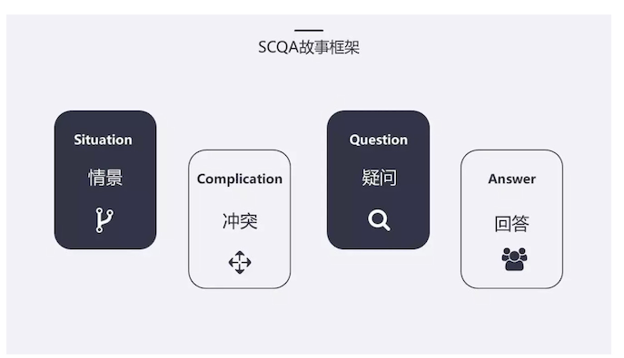
- SCQA模型（归纳总结） https://www.jianshu.com/p/b946e06c9fa9
    - 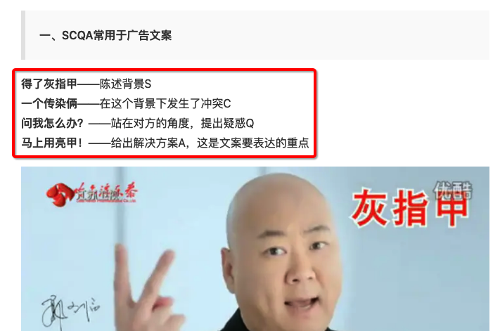
    - 这个 栗子太匹配了 :")
- 麦肯锡套路之 MECE 原则 https://www.sohu.com/a/275210270_99950394

----------------------------------------

> 相信自己没病的病人是没法治的，但咨询第一定律说的就是他们从来不会承认自己有病。
>
> 这下顾问就有大麻烦了。
>
> 一种变通的办法就是赞同客户很能干，然后问问是不是有什么可以改进的地方。没几个人愿意承认自己有病，但大多数人愿意承认能够有所改进，除非这人真的病入膏肓了。
>
> 注意不要由于急切地想要得到工作而表现得太过火。如果你承诺的改进太多，客户根本就不会聘用你，因为这会迫使他们承认自己有问题。
>
> 咨询第一定律的一个*推论*就是百分之十承诺定律：
>
> 永远不要承诺百分之十以上的改进。
>
> 大多数人可以把百分之十的改进归为心理上“没问题”一类。但如果顾问改进得再多，就有点让人难堪了。
>
> *百分之十*的解决方案
>
> 另一个推论是百分之十解决方案定律：
>
> 如果不小心让改进超过了百分之十，要确保没人注意到它。
>
> 确保没人注意到的最好方法，当然就是把它们都归功于客户。不会掩饰自己巨大成功的顾问就像用餐巾擦鞋的客人一样，主人不会再请他们了。
>
> 《咨询的奥秘》  
> https://book.douban.com/subject/25785829/

有趣 又 很真实的样子 :")

## 单位引起的故障及其应对实践 - 2020-10-29

> 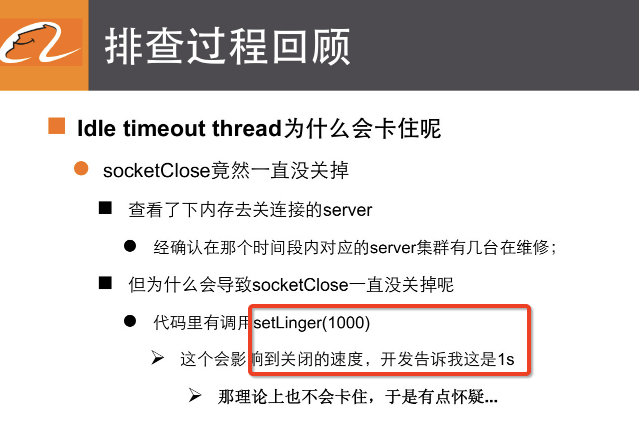
>
> 阿里巴巴 API单位误解造成的严重故障 林昊 阿里巴巴 2014  
> https://myslide.cn/slides/17570

可以不同的 实践 解法，如

1. 变量名 有带单位`int periodMs`
    - 需要更多人力来执行保证
2. 使用时长类型`Duration`
    - 解法本身是 优的，且有类型安全
    - 但这个做法 使用上比较重，想想多的`Duration`的构造代码，这点弊端 语言本身（语法糖）可以辅助解决，如`C++ 11/14`、`Scala`有语法糖支持。

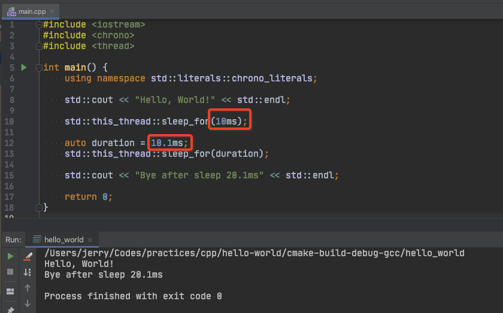

## 你又在滥用继承！继承不是为了复用代码，而为了被复用 - 2020-10-20

> 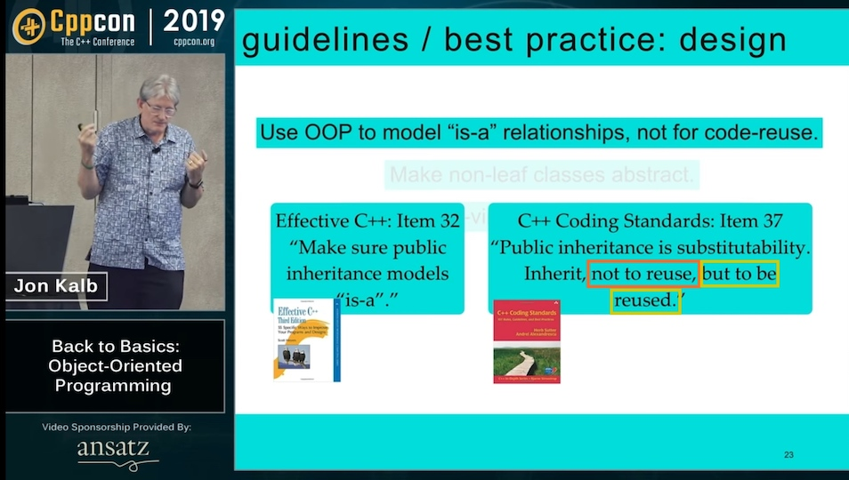
>
> OOP - Back2Basics - CppCon 2019 by JonKalb
>
> Public inheritance is substitutability.  
> Inherit, not to reuse, but to be reused.
>
> — [C++ Coding Standards](https://www.oreilly.com/library/view/c-coding-standards/0321113586/ch38.html): 101 Rules, Guidelines, and Best Practices

翻译：

- 外部接口是可替换性（`substitutability`）。
- 继承不是为了复用代码（面向实现者），而为了被复用（面向使用者）。

个人解读：

- 继承不是为了复用代码：
    - 以实现者/提供者出发的视角，认为『继承手段』会带来后面复用的好结果。
    - 至于真的有没有复用起来，没有被关心与回答：将来可能吧？～继承提供复用可能，多COOL！
- 而是继承为了被复用：
    - 以使用者/消费者出发的视角，认为要被复用，有了『复用的需求』，通过继承手段组织与实现复用。
    - 这样先要求实现者使用继承时，要明确清楚复用的场景，因为『复』用 肯定清楚是『多个』业务场景是如何使用。
    - 自然往往进一步要说明：为什么这个场景是有复用基础的，复用部分为什么是抽象相同的；继承的父类名还为这个抽象相同的概念取了个名字。
- 使用继承所带来的成本并不低：
    - 概念的增加，理解成本的增加，代码层次与代码量的增加，等等等等
    - [脆弱的基类问题](https://zhuanlan.zhihu.com/p/265736406)：兼容的成本与问题、实现时的小心翼翼、可能的实现继承的`Bug`、等等等等

讨论：

- 能带来我们期望的代码复用 是 接口所代表概念有可替换性（接口的实现可被替换）、模型设计，不是 继承 这个手段实现替换性的手段。
- 将继承这个手段用于代码复用，结果是一个不能理解的杂乱四不像，不敢改也改不得（如 [脆弱的基类问题](https://zhuanlan.zhihu.com/p/265736406)）。

PS:  
历年CppCon资料的Github Org： https://github.com/CppCon
https://github.com/CppCon/CppCon2019

## `ConcurrentMap`/`ConcurrentHashMap`的`computeIfAbsent`只执行一次吗？ - 2020-10-12

1. `ConcurrentMap`接口的`default`实现，**没有**保证`function`只执行一次：  
    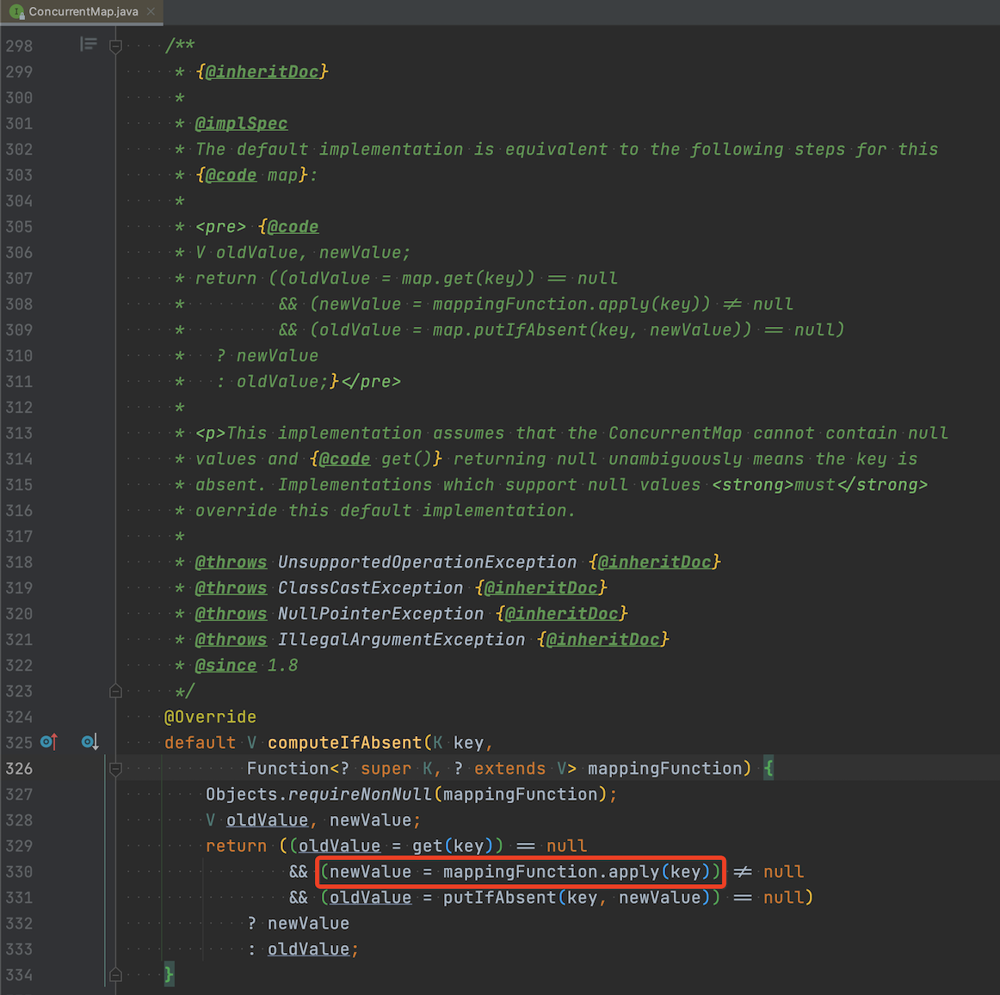
    - `ConcurrentMap`默认实现是检查`putIfAbsent`后的结果
        - 如果返回`null`说明自己`putIfAbsent`成功了
        - 如果返回其他，说明是别人成功了，那么就直接返回别人的结果，放弃自己`compute`的结果。
2. `ConcurrentHashMap`实现类强化，保证`function`只会执行一次：  
    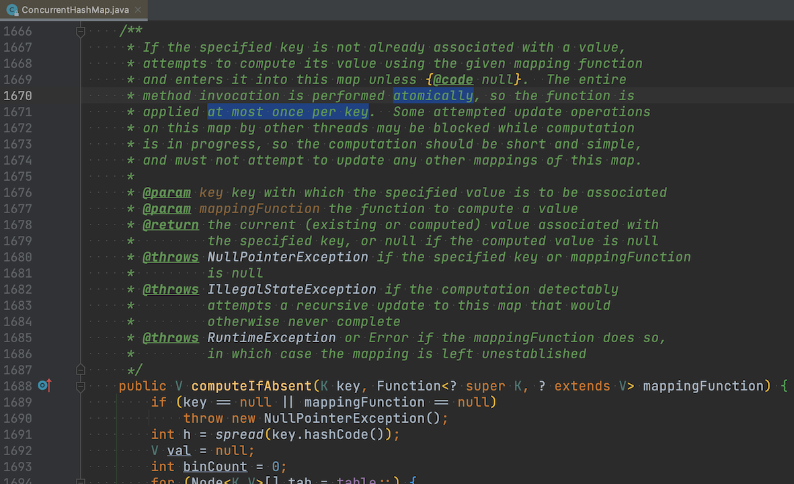
    - `ConcurrentHashMap`里面的`putIfAbsent`根据`key`的`hash`通过分段锁来同步，只有一个人能`put`成功。

## 面向对象/过程化程序设计、依赖策略 - 2020-10-10

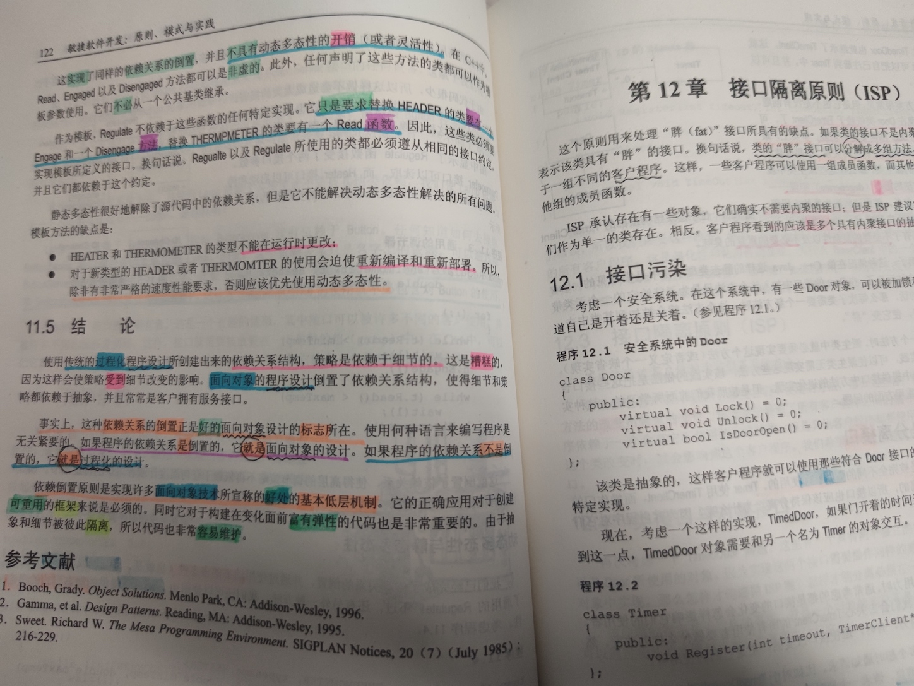

使用传统的过程化程序设计所创建出来的依赖关系结构，策略是依赖于细节的。
这是糟糕的，因为这样会使策略受到细节改变的影响。

面向对象的程序设计倒置了依赖关系结构，使得细节和策略都依赖于抽象，并且常常是客户拥有服务接口。

事实上，这种依赖关系的倒置正是好的面向对象设计的标志所在。
使用何种语言来编写程序是无关紧要的。

如果程序的依赖关系是倒置的，它就是面向对象的设计。
如果程序的依赖关系不是倒置的，它就是过程化的设计。

依赖倒置原则是实现许多面向对象技术所宣称的好处的基本低层机制。

它的正确应用对于创建可重用的框架来说是必须的。
同时它对于构建在变化面前富有弹性的代码也是非常重要的。
由于抽象和细节被彼此隔离，所以代码也非常容易维护。

## Statistical Thinking - 2020-09-16

> Statistical Thinking
> https://www.youtube.com/watch?v=OJt-k9h9pmk&list=PLRKtJ4IpxJpBxX2S9wXJUhB1_ha3ADFpF
>
> 统计的视频列表，作者是google决策智能小组的TL

- 非常赞，几分钟就讲好了统计的很多元问题概念/特征，深入浅出
- 比我之前看N本书收获还大

个人的学习的简单理解：

- 什么是统计/Statistics？
    - Change your mind
    - Get your answner *with UNCERTAINTY*  
    （特征是有 UNCERTAINTY，有不确定性）
- 如果得到的是确定结论，如
    - 小鱼缸里有*4*条*金鱼*，数出来，是金鱼，你有100%确定性
    - 你是在分析推演（数数、认识是金鱼）
- 什么时候用统计？
    - 对于简单结论（Which's Your Best Guess），你的直觉往往就很好使，不需要统计。
    - 对于那个结论要好多少（定量）时，就要用统计工具了，直觉不好使了。
- 定量分析，是为了保证你的ROI：
    - 不同决策有不同的投入
    - 从做的N次决策中积累出更好收益

PS：个人的对『统计』的简单理解：

- 大系统复杂性往往不可能了解到足够的信息来做分析推理（因为系统组件太多、因为时间不够……）。
    - 复杂系统的理解、处理的方式往往 是 实验验证、归纳，
    - 把系统当作黑箱，用实验捅一捅，看看反应结果，归纳系统的反应特征。
    - 我们写个测试Case 看看，其实就是实验捅一捅。如果测试能通过，我们对系统信心就增加一些。
- 实验（验证）是科学（方法论）的特征。（*实证*）  
  统计（应用学科）是 实验学科是基础，概率论（理论学科）是统计的基础。
- 另一面，我们做系统的模型设计 是 基于 推演的分析 （*心证*，与 实验/归纳/统计 对应）

## 近义多个的概念名 - 2020-09-08

> 当你问代理机制的时候？指的是Agent,Proxy,Broker还是Delegate呢？  
> https://mp.weixin.qq.com/s/-YD50VWHXobDm8VqTDOBYg

当你问代理机制的时候？指的是`Agent`、`Proxy`、`Broker`还是`Delegate`呢？  
代理，英文有4个词（概念分析），中文用词少区分度 低 :")

类似，中文说的 缓存 英文有2个词，`buffer`、`cache`，
一般2者的区别是什么？  
感觉有时候，英文也在混用。操作系统里，这2个词区分 明显些。
https://stackoverflow.com/questions/6345020/what-is-the-difference-between-buffer-vs-cache-memory-in-linux

### 大家的讨论

- Mr. X：
    - buffer 缓冲、cache 缓存 / 缓'从'（视各地口音而定）
    - Reply By `@oldratlee`：
        - 口音？投资 vs 投机，是吧？ O_o
- Mr. Y:
    - 简单理解，buffer是写的，cache是读的
    - Reply By `@oldratlee`：
        - 我可以理解成 buffer 的数据 不能改写？
- Mr. G:
    - 强调的特性不同，buffer强调写的时候缓冲写入量的特性，肯定也会被读出，cache是强调读的时候的命中率，肯定也有写入过程，但不是重点
    - Reply By `@oldratlee`：
        - Cache 和 Buffer 都是缓存，主要区别是什么？ - 知乎  
        https://www.zhihu.com/question/26190832  
        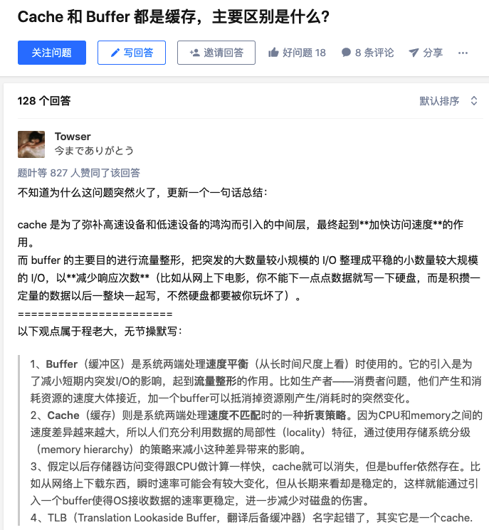
        - 如果 按这个理解 ， buffer cache 就可以 组合了。
        - cache 就用 加速（2份数据，当然就引入 一致性的问题，cache invalidation ，计算机的2大难题 之一）
        - buffer （IO）流量整形（自然 一般不能 会改写，除非 切成 Cache模式）
        - Buffer 用了不释放， 接着当 Cache用，  这样的使用 就是 Buffer-Cache 了  
        注： 顺序是有意义的， 有 Buffer-Cache ，没有 Cache-Buffer ，:")
        - 感觉 ， 里面的数据 能不能 改写，是一个区分 Buffer/Cache 2者的特征。
- Mr. K:
    - 有Buffer-Cache这样的场景吗，一下没想到，这两一起合用挺奇怪的
    - Reply By `@oldratlee`：
        - os里有的，极致优化的结果
- Mr. S:
    - buffer 和 cache 的命名 是从功能特征出发的，从功能职责出发的，区分自然也在功能职责上
- Mr. B:
    - 从另一个角度来说，buffer是解决读写速率不一致的产物，所以我说翻译中带了个‘区’ ，也就是buffer zone 。cache主要用来提高读/写速率的产物。 区别还是很大的
- Mr. F:
    - 个人理解：buffer是缓冲，逻辑概念，用于减震 ；cache是缓存，物理概念，用于高低速设备之间，提高IO性能
    - 理论上慢速设备也可以用来做buffer，比如kafka队列

## 整洁的架构/编程范式 - 2020-08-28

- （纯）函数式编程/FP 约束/限制/规范化/纪律化（discipline） 成 
不变/修改 mutation （或说 赋值 assignment），只用不可变 immutable
- 面向对象 OOP 纪律了 函数指针间接，只有 多态。让 代码依赖 与 执行依赖反转（即 模块化）  
- 结构化编程 纪律了 控制跳转，不用goto 只用 条件/循环。

bob的《整洁的架构》 整个 Part 1 编程范式 讨论上面的内容。
简介有bob视频 
https://youtu.be/P2yr-3F6PQo

## 并发 - 2020-08-28

> Posted by Mr. G

刚才和`@oldratlee`讨论并发情况下“原子性”问题，“原子性”代表的是不可分割并整体并付，或者在并发环境中会发生非常奇怪的不可预测的问题。

举个上传的例子，我们假设有个功能是上传文件大小和分片大小是可以调整的，通过配置中心发布，处理上传的线程会读取这个配置来修改上传的策略，我们会设计两个全局变量`fileSize`、`chunkSize`，当我们通过配置中心发来更新这两个值时会发生什么呢？：

- 假设当前的fileSize=10M, chunkSize=5M;
- 这次变更调整的目标是fileSize=4M,chunkSize=2M;
- 由于并发的原因，会出现更新线程修改到fileSize=4M, chunkSize=5M;
- 而上传处理线程读取到4M的临界判断，又同时读到了5M的chunkSize，再这之后变更线程才修改chunkSize=2M;上传处理线程就会用fileSize=4M, chunkSize=5M这样一个古怪的组合处理上传逻辑，造成无法预料的结果。

这里的本质是“原子性”是什么，`{fileSize, chunkSize}`应该被一齐交付，我们会设计一个UploadPolicy的类，包括`{fileSize, chunkSize}`两个属性，配置更新时创建一个临时的UploadPolicy对象，完成属性的设置，再一次赋值给全局变量，这样上传线程就会取到一个“原子性”的变更，避免上面的问题。这个问题还可以更深入到一次处理流程的一致性上，是个非常常见的问题。

推荐《Java并发编程实战》，经典书籍。值得仔细研究，反复推敲和实践。讲了原子性，可见性，不变性，逸出这些非常本质的问题。还包括了java的内存模型。

### 大家的讨论

- [`@zavakid`](https://github.com/zavakid)：
    - 作者之一是 Doug Lee 大牛， java 的 内存模型 和 JUC 包 就是他的作品。 （还有在 Java9 引入的 reactive  Flow API 也是 Doug Lee）
- Mr. M：
    - jdk里面atomicreference是专门解决这类问题，普通的变量直接替换，假设filesize和chuncksize是不同线程检查，还需要volatile保障可见性，要mesi协议来解决硬件跨cpu缓存的问题。
- Mr. D：
    - 这个场景用不可变性应该能完全避免race，比如在上传session创建的时候把这种只读配置拉一份副本。
    - Reply By Mr. G：
        - 本质是更新的原子性，引用时的不可变性
- `@oldratlee`：
    - 自己整体的书单：Concurrency/Parallelism/并发/并行  
      https://www.douban.com/doulist/41916951/
    - 自己整理的简单并发问题的可运行复现的Case工程：  
      https://github.com/oldratlee/fucking-java-concurrency  
        - 🎏 Simple show cases of java concurrency problems, seeing is believing.
        - 并发程度设计在分析和实现中，复杂度大大增加。 如果不系统理解和充分分析并发逻辑，随意写代码，这样的程序用 『碰巧』 能运行出正确结果 来形容一点都不为过。  
        这里的Demo没有给出解释和讨论，并且都是入门级的，更多了解请参见一些并发的问题讨论和资料。
    - 通过Java体系地学习并发之后，发现我自己不敢写C/C++的并发代码了，
自己之前写得都没有经过并发正确性的证明（都是在『碰巧』运行对），因为对C/C++栈下的并发构件的了解不够。
    - 体系学习推荐
        - 《Java并发编程实战》
        实战与理论并重，第16届Jolt大奖提名图书，Java应用并发编程圣经级图书。
        力荐！力荐！！力荐！！！
        实用实践和不那么逻辑化，体系学习的ROI是最高的。
        - 《Java并发编程：设计原则与模式》
        Doug Lea大神20多年前的著作（原版第一版1996年出版），思考、方法论和原理是不变的，现在看起来一样有着*恐怖的震慑感*。
        - 《多处理器编程的艺术》
        理论硬核的书，两位作者在2004年获得了理论计算机领域最高奖——哥德尔奖
    - 并发编程模式的广度了解
        - 七周七并发模型
        - Java虚拟机并发编程
        - Scala并发编程

## 软件设计书籍 - 2020-08-19

- 《整洁的架构》
- SOLID五大经典原则的阐述，可以结合另一本书看《敏捷软件开发 : 原则、模式与实践》， 从原则->模式->实践。经典神作，2002的书，过去快20年了。
    1. 软件设计与（OOP）语言无关
    2. 书名趁当年 赤热『敏捷』话题
    3. 现在要看 副标题 PPP(Principles, Patterns, and Practices，软件开发的原则、模式与实现) ，典型不过时

## 模块形状（深/高瘦程度）作为抽象/系统设计/建模的好坏的判断 - 2020-08-07

做了[`compileflow`开源项目的代码review](../compiler-flow-code-review/README.md)。

其中一部分是[系统设计](../compiler-flow-code-review/README.md#3-系统设计)的内容：

`exception`、`contants`、`model`、`(error)code`这样的包 司空见惯 的 不好实践，个人觉得……

- 面向技术独立包 会导致
    与业务域（要解决的问题）关联不强的孤立技术类。
    这样的代码孤立感来自：与使用它的对应域的类远了，域代码文件没有一目了然地排在一起。
- 『因为按技术划分，看起来包下的类变少了，往往隐藏了 业务域的下拆不足，即影响领域拆分梳理优化。』

《软件设计哲学》里的 深模块 的概念非常好：
抽象/系统设计/建模的好坏 通过 模块形状（深/高瘦程度）来判断。
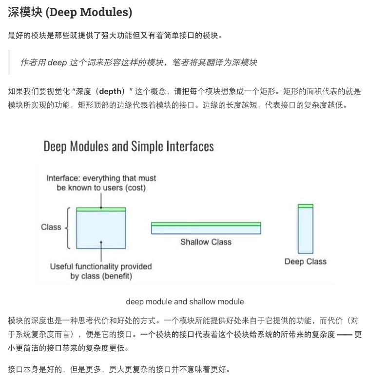。

Review过程中，讨论到了[扩展设计 的实践](../compiler-flow-code-review/README.md#32-扩展设计)（如 是否要 spi包名）。

> 《A Philosophy of Software Design》  
> https://book.douban.com/subject/30218046/  
> 出版年: 2018-4-6
>
> 这本书 看了一些，觉得确实 名符其实。

## Unknown is Unknown! - 2020-08-24

- 平时很多时候有『不知道』的状态，把`Unknown`处理成`False` 或 `not Unknown`处理成True，实现逻辑的问题就来了。
- 这类的Bug在线上系统看得到不少。 :")
- 也可以理解成『其他』情况，说明 自己模块的建模是不完备的：
    - 有些情况 *不是* 自己能处理的。
    - 要代理 到 系统上层 才能处理，做Fallback。
    - Fallback往往处理成：就好像没有这个模块一样。

> Wikipedia: Three-valued logic, Kleene and Priest logics  
> https://en.wikipedia.org/wiki/Three-valued_logic#Kleene_and_Priest_logics
>
> 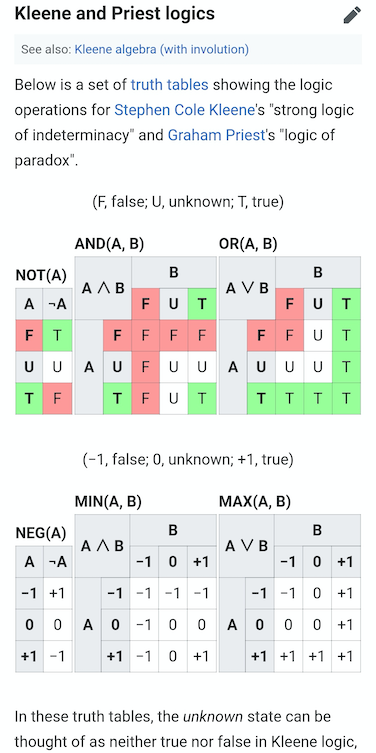

## Reactive programming: lessons learned - 2020-06-01

> JDD 2018: Reactive programming: lessons learned by Tomasz Nurkiewicz  
> https://www.youtube.com/watch?v=5TJiTSWktLU
>
> 最近在JVM上，协程已成为反应式编程（Reactive Programming）的一种替代方法。诸如RxJava或Project Reactor之类的框架为客户端提供了一种增量处理传入信息的方式，并且对节流（throttling）和并行（parallelism）提供了广泛的支持。但是，必须围绕反应流（reactive streams）上的函数式操作（functional operations）来重新组织代码，在很多情况下这样做的成本是高过收益的。
>
> 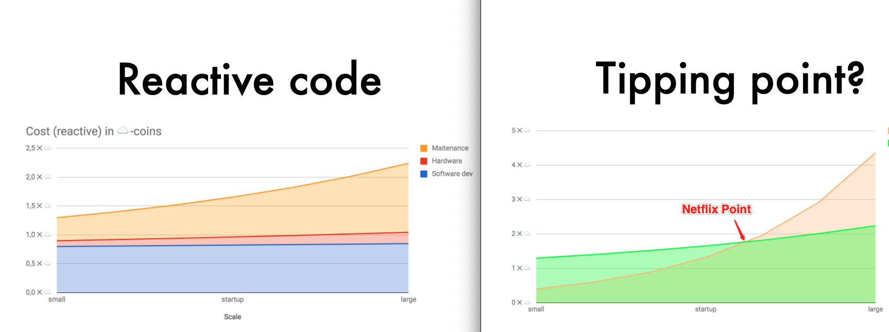
>
> PPT: https://nurkiewicz.github.io/talks/2018/reactive-lessons/

提到了好几个 观点与概念：

1. Netflix point（高伸缩代码实现相对低实现 的 收益 交叉点）
2. 软件成本的组成及其变化趋势 （ hardware/software dev/maintenance）
3. 团队的代码标准 ： boring vs. interesting

我们 这么业务的做法， 有到 『奈飞点』 了吗？

- 大象 会 跨过 『奈飞点』
- 一群 *自治*的 蚂蚁，看起来是个 大象，却不是。

## 每当我想放弃`Scala`，我就写写`Python`和`Java` - 2020-05-08

> 每当我想放弃`Scala`，我就写写`Python`和`Java` - InfoQ  
> http://m.vlambda.com/wz_7izXvEgXpko.html  
> By Li Haoyi
>
> 对我来说，`Scala`语言本身处于一个相对良好的状态。花一整个下午的时间编写现代`Java`代码就足以让我摆脱“其他编程语言已经迎头赶上`Scala`”的想法，花了几天时间尝试（最终并未成功）将`Python`项目打包成一个独立的可执行文件也是如此。
>
> `Scala`未来最大的潜力在于发展新的用户群，以及寻找新的应用场景，到目前为止，这些都完全不在社区的考虑范围内。但在我看来，有两件事很重要。

作者说得很理性，同时字里行间也能感受到作者对`Scala`的热情～  
特别是能感受到给社区的提醒：虽然（前几年）推广造势的不错，但在 易用性 和 增加使用场景 上需要多费心，这才是基础！  
（作者在应用层的易用性上可以说做了很多事情）  

而 易用性（使用成本） + 使用场景多 都是做规模化的思路之二～

`Kotlin`也是在这两个方面想做好，特别是易用性方面，能感受到`Kotlin`在 易用性 和 语言特性 上所做的权衡。  
（我相信想要做出类似`Scala`或者其他语言的特性，对于`JetBrains`这帮人 基本不是挑战～）

Posted By [`@zavakid`](https://github.com/zavakid)

### 大家的讨论

- `@oldratlee`：
- 提升易用性、扩宽应用场景，确实是 产品发展和打法的关键

## 业务价值体感化的套路模式 - 2020-05-02

- 录屏，效果变化体感
- 出问题的`App`样子，截屏
- 用户的反馈、舆情
- 将技术指标转化成业务表达、效果提升
    - 如转化成活跃用户的规模增长、单位时间成交转化率的提升

## 基础设计理念的持续滚动成为代差 - 2020-05-01

> 关于spring的作者
>
> spring的缔造者Rod Johnson。这位仁兄很牛，出生于澳大利亚，毕业于悉尼大学计算机系。到这还是平平无奇，但是他还有另一个身份，音乐学的博士。因为自己爱好音乐，便攻读了音乐学的博士。果然编程的极致是艺术，而艺术相通的。
>
> 「spring」Spring的前世今生，作者与由来  
> https://baijiahao.baidu.com/s?id=1620099105315862154

- 好的基础设计理念，初看不起眼，坚持持续滚动迭代会出代差。
- 依赖注入（`DI`/`IOC`）和`AOP`，把`EJB`打得满地找牙！

## 事实和观点 - 2020-04-30

> 事实和观点
> https://www.jianshu.com/p/5157faf3a6b5
> https://www.jianshu.com/p/06f4347e94ac

在《批判性思维》作者提到培养独立思考的能力的方法，其中之一就是能够甄别观点（opinion）和事实（fact）。

- 什么是事实？
    - 就是在客观世界中可以被证实或者证伪的就是事实，就是能分清真假
    - 比如说今天气温30度。
- 什么是观点？
    - 就是在一套认知体系中，不违反事实，逻辑自洽，无法证明真假的东西。
    - 比如今天很热
- 是否 可证伪 是 科学 和 事实 两者的特征。
- 有了这个特征，想到这句话：『科学尊重事实』
    - 其实是个 循环定义，这句话 没信息量。
    - 『可证伪』这个特征 是 信息量。

## `Lombok`与语法糖 - 2020-04-28

> `Lombok`是让你代码处于“亚健康”状态的真正元凶  
> https://blog.csdn.net/xhmj12/article/details/107053672

文章提到的几个点，分开说：

1. `Lombok`的简化思路
    - 如果`data class`合理的前提下，简化代码&更好的表意 思路是对的。
    - 毫无疑问，`Kotlin`这一块 吊打`Lombok`，当然后面提到的评估决策要做得更多。
2. 升级的问题
    - 对于一个库，升级`JDK`不能用了是这个库的一个致命问题；合格上心的库作者应该要做好。
    - 对库使用者，关注库的兼容性，并有适度的容忍期限也是应该的。
        - 如升级能有些回归；能等待一段时间让库作者修复问题。
3. 学习&理解成本
    - 任何东西都有学习成本。
    - 决策者根据情况（如团队成员、项目特点）有个评估判断。

> 对库使用者，关注库的兼容性，并有适度的容忍期限也是应该的。

这句话里我想说的，更积极直白的表述是：  

- 使用者 不去改进贡献也算正常
- 但至少要少一些『得好处忘掉、有了不爽就diss』还觉得这样心安理得的伸手党心态

## 《程序员修炼之道》 - 2020-04-16

《程序员修炼之道》出[第二版](https://book.douban.com/subject/35006892/)了！ 🤘 🚀

这本书，在我个人的软件职业专业与水准的书籍中，排名第一。

薄薄的300多面，讲了软件专业与职业的N个维度：

- 文档（以及写作）、测试、编码、系统设计/抽象、编程语言…
- 日常工具：命令行、编辑器、版本控制…
- 交流表达、项目管理/团队管理、认知规律、批判思考…
- 职业态度、知识投资…
- ……

奔流着 专业洞见、深度思考，个人无以复加的推荐！

『程序员应该一年学一门语言』这个观点出自这本书。

记得自己读大学时在图书馆借了看过，当时心里想：讲了些什么玩意儿；几乎没一点收获和共鸣。  
后来工作实践多年，再买了读，惊了。

所以个人对这本书评价：

这本书是个人软件专业素养的**试金石**。即  
如果看了反应共鸣不多，则自己的专业素养有待提升。

当然，要理解别人的洞见是以个人自己积累的实践与思考为前提。

## 代码设计 - 2020-04-16

- 用`boolean`返回值 来做为 操作成功/出错的指示
    - 对于永远返回`true`的实现，往往是漏掉了出错汇报、实现有Bug！
    - 需要文档（用`JavaDoc`）说明上 这个方法的出错 契约
    - 对于 出错汇报，如果可能，一般推荐 用异常，而不是错误码（`Java`的常用最佳实践）
- 命名 几乎是 系统建模的全部体现。
    - 即 命名不达意，是 整体设计问题
- 软件实现/设计 最难的2件事：
    1. 命名：背后是 系统建模
    2. 缓存失效：背后是 并发
    3. 偏1误差：背后是 算法/过程的表达
