# 软件实践碎碎念 - 2021

> 往年：
>
> [软件实践碎碎念 - 2020](2020.md)

----------------------------------------

<!-- START doctoc generated TOC please keep comment here to allow auto update -->
<!-- DON'T EDIT THIS SECTION, INSTEAD RE-RUN doctoc TO UPDATE -->


- [PD - 2021-06-20](#pd---2021-06-20)
- [软件架构 + 微积分 - 2021-06-19](#%E8%BD%AF%E4%BB%B6%E6%9E%B6%E6%9E%84--%E5%BE%AE%E7%A7%AF%E5%88%86---2021-06-19)
    - [大家的讨论](#%E5%A4%A7%E5%AE%B6%E7%9A%84%E8%AE%A8%E8%AE%BA)
- [代码组织与测试 - 2021-06-17](#%E4%BB%A3%E7%A0%81%E7%BB%84%E7%BB%87%E4%B8%8E%E6%B5%8B%E8%AF%95---2021-06-17)
    - [大家的讨论](#%E5%A4%A7%E5%AE%B6%E7%9A%84%E8%AE%A8%E8%AE%BA-1)
- [DOOM启世录 - 2021-06-17](#doom%E5%90%AF%E4%B8%96%E5%BD%95---2021-06-17)
- [软件架构定律 - 2021-06-15](#%E8%BD%AF%E4%BB%B6%E6%9E%B6%E6%9E%84%E5%AE%9A%E5%BE%8B---2021-06-15)
- [基于开源的商业模式 - 2021-06-15](#%E5%9F%BA%E4%BA%8E%E5%BC%80%E6%BA%90%E7%9A%84%E5%95%86%E4%B8%9A%E6%A8%A1%E5%BC%8F---2021-06-15)
- [微信背后的产品观 - 2021-06-07](#%E5%BE%AE%E4%BF%A1%E8%83%8C%E5%90%8E%E7%9A%84%E4%BA%A7%E5%93%81%E8%A7%82---2021-06-07)
- [统计 几何平均数 - 2021-05-29](#%E7%BB%9F%E8%AE%A1-%E5%87%A0%E4%BD%95%E5%B9%B3%E5%9D%87%E6%95%B0---2021-05-29)
- [心智负担的游戏 - 2021-05-10](#%E5%BF%83%E6%99%BA%E8%B4%9F%E6%8B%85%E7%9A%84%E6%B8%B8%E6%88%8F---2021-05-10)
    - [大家的讨论](#%E5%A4%A7%E5%AE%B6%E7%9A%84%E8%AE%A8%E8%AE%BA-2)
- [如何有效地设置系统报警？ - 2021-04-24](#%E5%A6%82%E4%BD%95%E6%9C%89%E6%95%88%E5%9C%B0%E8%AE%BE%E7%BD%AE%E7%B3%BB%E7%BB%9F%E6%8A%A5%E8%AD%A6---2021-04-24)
- [信噪比 - 2021-04-21](#%E4%BF%A1%E5%99%AA%E6%AF%94---2021-04-21)
    - [大家的讨论](#%E5%A4%A7%E5%AE%B6%E7%9A%84%E8%AE%A8%E8%AE%BA-3)
- [依赖分析 - 2021-04-16](#%E4%BE%9D%E8%B5%96%E5%88%86%E6%9E%90---2021-04-16)
    - [大家的讨论](#%E5%A4%A7%E5%AE%B6%E7%9A%84%E8%AE%A8%E8%AE%BA-4)
- [解题理念关键字/核心方法 - 2021-04-06](#%E8%A7%A3%E9%A2%98%E7%90%86%E5%BF%B5%E5%85%B3%E9%94%AE%E5%AD%97%E6%A0%B8%E5%BF%83%E6%96%B9%E6%B3%95---2021-04-06)
- [多余的『用null初始化』 - 2021-04-02](#%E5%A4%9A%E4%BD%99%E7%9A%84%E3%80%8E%E7%94%A8null%E5%88%9D%E5%A7%8B%E5%8C%96%E3%80%8F---2021-04-02)
    - [大家的讨论](#%E5%A4%A7%E5%AE%B6%E7%9A%84%E8%AE%A8%E8%AE%BA-5)
- [当你编码时，事物命名 - 2021-03-12](#%E5%BD%93%E4%BD%A0%E7%BC%96%E7%A0%81%E6%97%B6%E4%BA%8B%E7%89%A9%E5%91%BD%E5%90%8D---2021-03-12)
    - [大家的讨论](#%E5%A4%A7%E5%AE%B6%E7%9A%84%E8%AE%A8%E8%AE%BA-6)
- [`SICP`作者的新书《面向灵活性的软件设计》 - 2021-03-11](#sicp%E4%BD%9C%E8%80%85%E7%9A%84%E6%96%B0%E4%B9%A6%E9%9D%A2%E5%90%91%E7%81%B5%E6%B4%BB%E6%80%A7%E7%9A%84%E8%BD%AF%E4%BB%B6%E8%AE%BE%E8%AE%A1---2021-03-11)
- [迭代效率之于工程 2021-02-18](#%E8%BF%AD%E4%BB%A3%E6%95%88%E7%8E%87%E4%B9%8B%E4%BA%8E%E5%B7%A5%E7%A8%8B-2021-02-18)
    - [大家的讨论](#%E5%A4%A7%E5%AE%B6%E7%9A%84%E8%AE%A8%E8%AE%BA-7)
- [公共知识 与 主动宣导 - 2021-01-29](#%E5%85%AC%E5%85%B1%E7%9F%A5%E8%AF%86-%E4%B8%8E-%E4%B8%BB%E5%8A%A8%E5%AE%A3%E5%AF%BC---2021-01-29)
- [谷歌可靠性工程的设计经验 - 2021-01-21](#%E8%B0%B7%E6%AD%8C%E5%8F%AF%E9%9D%A0%E6%80%A7%E5%B7%A5%E7%A8%8B%E7%9A%84%E8%AE%BE%E8%AE%A1%E7%BB%8F%E9%AA%8C---2021-01-21)
- [Magic Go Lang! - 2021-01-18](#magic-go-lang---2021-01-18)
    - [大家的讨论](#%E5%A4%A7%E5%AE%B6%E7%9A%84%E8%AE%A8%E8%AE%BA-8)

<!-- END doctoc generated TOC please keep comment here to allow auto update -->

----------------------------------------

## PD - 2021-06-20

这周刚拜读完《微信背后的产品观》；天猫原价才买到，否则缺货。

最近又补课一系产品的书：

- 《[微信背后的产品观](https://book.douban.com/subject/35339729/)》
- 《[从点子到产品](https://book.douban.com/subject/26927349/)》
- 《[用户思维+：好产品让用户为自己尖叫](https://book.douban.com/subject/27129563/)》

PS： PD书单 https://www.douban.com/doulist/41792144/

- 产品思维/用户思维 无处不在，有用、发人思考、能更好解决问题就是好猫。
- 《用户思维+：好产品让用户为自己尖叫》个人被冲击太大。好的内容就是容易被人无视但又应该变成习惯的常识。

----------------------------------------

微信之父张小龙内部100多页PPT，全面剖析微信背后的产品观：

- 文字版 https://www.cnblogs.com/end/p/5521138.html 
- PPT图片版  https://www.163.com/dy/article/FQ230RUA051998SC.html
- 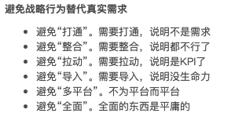  
    作为可能的注意项看看/想想，挺有意思的
- 今年1月张小龙出书了，《[微信背后的产品观](https://book.douban.com/subject/35339729/)》， 好薄 160面。

## 软件架构 + 微积分 - 2021-06-19

> Posted By [李强](https://github.com/beyondyuefei)
>
> 《[恰如其分的软件架构 : 风险驱动的设计方法](https://book.douban.com/subject/24872314/)》 - CH6 工程师使用模型：
>
> 我在就读高中时，曾经向父亲请教微积分作业。让我吃惊不已的是，尽管父亲从大学开始就在从工程师的工作，可他的微积分知识却很少被使用，早已生疏了。他还告诉我，
>
> - 他的公司雇佣掌握了微积分知识的工程师，并不是因为工作需要运用微积分，
> - 而是因为他们接受的工程训练，其中包括微积分练习，锻炼了他们运用抽象与模型解决问题的能力。
>
> 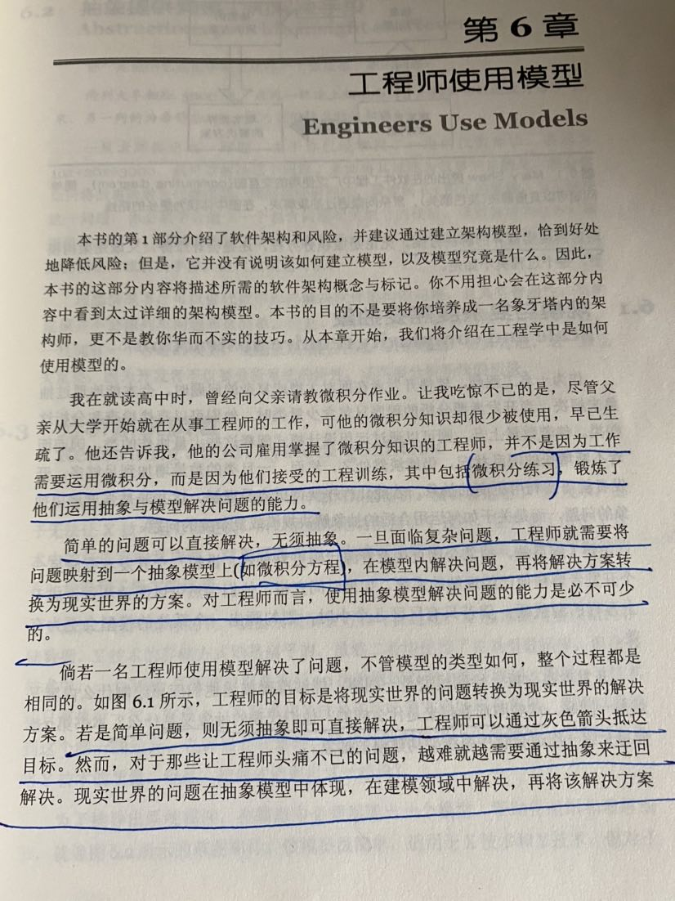

- 《架构整洁之道》讲的比较全面，但对《模型》等说的少，这本讲的多些，作者强调偏实战。
- 《架构整洁之道》我印象深的一句是：『软件系统的核心是业务策略（顶层），其他都是实现细节。』
    - 由此我想到，以前`@oldratlee`说过的：
        - 做一件事的划分，对每一部分能判断的清楚，而不是一上来就说某个点（不想听）。
        - 关键的划分和判断 体现的是你对整体的把控，这个是我想听的，后面某个难点/单点 可以再单独来说。
    - 现在我就非常理解了：可以类比Bob大叔说的 顶层业务策略和实现细节。
- [微积分/Calculus/数学分析/Analysis 书单](https://www.douban.com/doulist/119758751/)，微积分主题的好书很多。
    - 日常工作对逻辑推理、抽象和模型解决问题的能力都经常涉及到，所以既然那书里提到了微积分，那就看来看看/练练。
- 模型：先明确解决什么问题、抽象层次、细节取舍、增强推理、数学很重要（复杂的问题）。

### 大家的讨论

- Reply By `@oldratlee`：
    - 我再学习你的思考的这段话，细品了好几遍。反复直到进入血液成为习惯。
    - 微积分 是 宇宙的语言。
        - 『一个神秘且不可思议的事实是，我们的宇宙遵循的自然律最终总能用微积分的语言和微分方程的形式表达出来。』 —— [《微积分的力量》](https://book.douban.com/subject/35292688/)  
          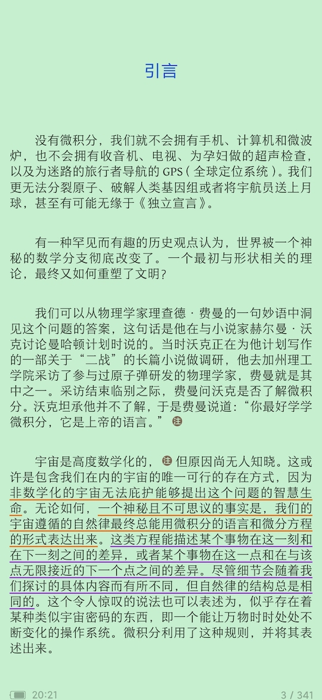
    - 因为工作项目要使用或了解自动控制、机器学习这样的应用数学，自然就引导到这儿了，我们有空看看就好，相信神的语言 一定很美，哈哈
        - [数据物理方法/微分方程/傅里叶变换 书单](https://www.douban.com/doulist/140038243/)
    - 或许 懂微积分的同学看不懂的同学，和人看猴子是一样的。不可理解的超越，哈哈
        - 上面这句纯粹是我这个外行人的**YY** 🤤 😂

----------------------------------------

- 内容也发到了[微博](https://weibo.com/1836334682/JuCn9cmNu)上。

## 代码组织与测试 - 2021-06-17

> How to organize your code? Organize code by concepts, not layers】http://t.cn/A6VnTnqF  
> 如何组织你的代码？ 按概念而非层组织代码

或者说，按面向业务概念/域组织代码，而非技术特征（技术分层、`exception`、`constants`）。

[`compileflow`开源项目的代码review 2020-08-02](../compiler-flow-code-review/README.md)的[系统设计](../compiler-flow-code-review/README.md#3-系统设计)一节里，
我也是重点说明、解释代码组织的问题：

- 应该怎样做？
- 为什么？

----------------------------------------

> [`compileflow`开源项目的代码review 2020-08-02](../compiler-flow-code-review/README.md)的[软件测试](../compiler-flow-code-review/README.md#43-软件测试)一节：
>
> 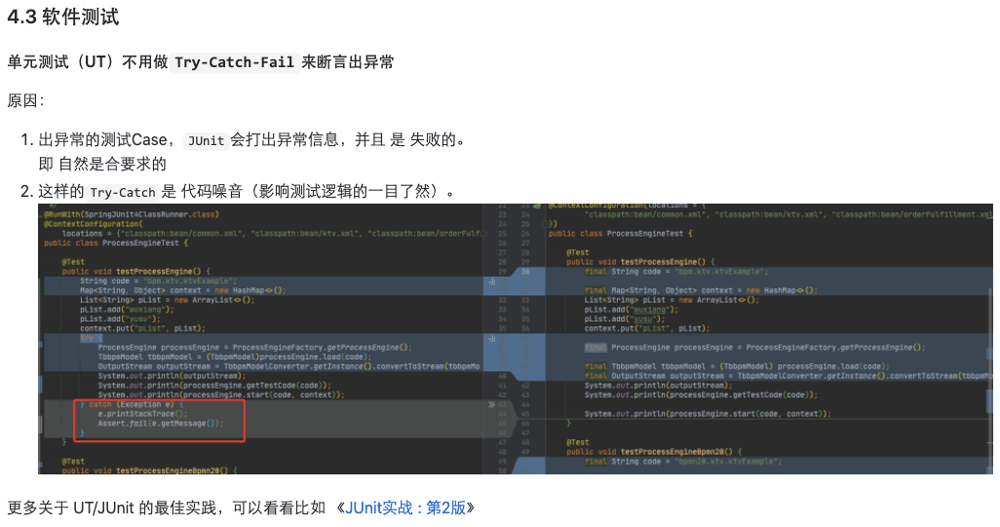

如何写测试， 程序员专业素养的核心体现（之一）。

- JUnit in Action, Third Edition 3rd Edition | December 8, 2020  
    https://www.amazon.com/JUnit-Action-Third-Catalin-Tudose/dp/1617297046
    - 经典，去年出第三版了
    - 程序员专业素养 测试能力 的力荐之作
- Test Driven Development: By Example by Kent Beck  | Nov 18, 2002  
    https://book.douban.com/subject/1230036/
    - TDD 布道大成之作

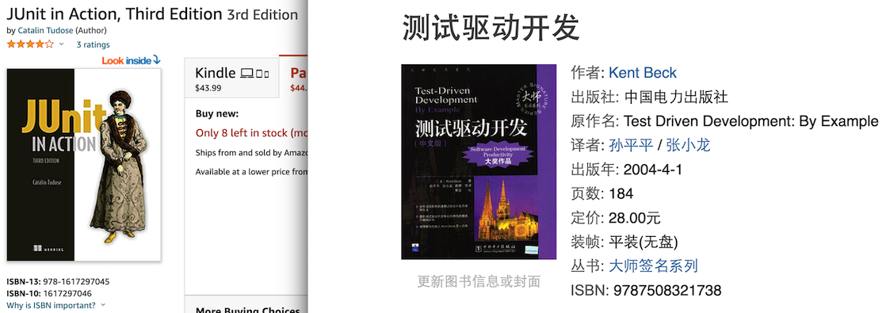

### 大家的讨论

- Mr. G：
    - 书虽然古老，但是技术非常实， 重构+单元测试， TDD 单测先行， 对开发的思路影响非常大。我们不是先写实现，而是设计了接口和方法后，先建立单测来确定每个方法的预期，编码需要通过每个单测。
    - 印象中还有个故事，是kent back他们在飞机上聊出来这个理念的。
    - 为了完备单测的工程体系，后面产生了JUnit、TestNG这类框架，又出现了JMock、Mockito这类的mock框架
    - 建立单侧去保障重构的可行性
- Reply By `@oldratlee`：
    - 我个人还一直没实践上到『先写测试再写实现』的Level （还是自己没勤于实践）
    - 但背后的一个理念/原因：先想需求梳理接口，有实践一直坚持，并在过程中 持续 思考优化梳理 接口。
- Reply By Mr. G：用单测来驱动强化了使用者的视角，让编码的同学清晰的知道别人会如何使用这个方法这个类；没有单测做为基础，重构就是空中楼阁；另外不要相信大型重构，那是重写，重构一定是小步骤的。
- Reply By [`@zavakid`](https://github.com/zavakid)：
    - 我也还没有……
    - 但还是可以做到：
        1. 一旦发现了问题或者 bug，可以通过写测试的方式，来杜绝下一次发现类似的问题，通过测试的方式，来确保项目永远不会产生同样的问题；
        2. 在写单元测试碰到卡壳时，会反过来调整优化代码结构，让单元测试更容易编写：写单元测试的方便程度也是在反馈代码使用的难以程度。
    - 重写 vs. 重构，有问题要改动时，应该总是优先选择改动小的，也就是重构，小步重构，通过单元测试确保兼容性。

## DOOM启世录 - 2021-06-17

> 《DOOM启世录》 https://mp.weixin.qq.com/s/a_No46xDB-zuZV-OM3plog  
>
> 在信息时代，客观障碍已不复存在，所有的障碍都是主观上的。如果你想动手开发什么全新的技术，你不需要几百万美元的资金，你只需要在冰箱里摆满比萨和可乐，再有一台便宜的计算机，和为之献身的决心。我们在地板上睡过，我们从河水中趟过。
>
> —— DOOM启世录

《DOOM启世录》豆瓣9.3，相当热血的说。

## 软件架构定律 - 2021-06-15

《[Fundamentals of Software Architecture](https://book.douban.com/subject/34464806/)》将 trade-off(取舍权衡) 定律化了，还补了个反面重复表述的推论一，有意思：

- 软件架构的一切都是取舍权衡。 — 软件架构第一定律  
    - Everything in software architecture is a trade-off. — First Law of Software Architecture
- 如果架构师认为他发现有的事不是取舍权衡，那么更可能是他还没有识别到需要的权衡。（译注：给将来留坑了……） — 推论一  
    - If an architect thinks they have discovered something that isn’t a trade-off, more likely they just haven’t identified the trade-off yet. — Corollary 1
- WHY 比 HOW 更重要。 — 软件架构第二定律  
    - Why is more important than how. — Second Law of Software Architecture

PS: 2021-6-6 刚出了中文版《[软件架构：架构模式、特征及实践指南](https://book.douban.com/subject/35487561/)》

----------------------------------------

- 内容也发到了[微博](https://weibo.com/1836334682/KkhYdCDo3)上。
- [软件架构/Architecture/架构师 书单](https://www.douban.com/doulist/112308024/)

## 基于开源的商业模式 - 2021-06-15

如果核心代码开源（为了竞争的垄断、推广），

1. 企业版本：好用的辅助功能、高级方案（如易地容灾、运维系统的无缝对接）
2. 技术服务支持
3. 云服务
    - 有了`SSPL`、`AGPL`协议，限制云厂商
        - [`SSPL`](https://zhuanlan.zhihu.com/p/106394073)，限制商用，比如云厂商如果拿来商用就必须要去找作者获取授权。
        - [`AGPL`](https://baike.baidu.com/item/AGPL/4949728)，扩展了`GPL`对“发布”的定义，要求使用者一定要开源自己的修改内容。
    - 之前`Redis`就苦于 云厂商用得飞起自己一毛钱关系没有。

## 微信背后的产品观 - 2021-06-07

微信之父张小龙内部100多页PPT，全面剖析微信背后的产品观

- 文字版 https://www.cnblogs.com/end/p/5521138.html
- PPT图片版  https://www.163.com/dy/article/FQ230RUA051998SC.html
- 今年1月张小龙出了对应的书《微信背后的产品观》 （好薄， 160面）

> 文字版 https://www.cnblogs.com/end/p/5521138.html
>
> 避免战略行为替代真实需求：
>
> - 避免“打通”。需要打通，说明不是需求
> - 避免“整合”。需要整合，说明都不行了
> - 避免“拉动”。需要拉动，说明是KPI了
> - 避免“导入”。需要导入，说明没生命力
> - 避免“多平台”。不为平台而平台
> - 避免“全面”。全面的东西是平庸的

作为可能的注意项 看看/想想，挺有用有意思的。

PS:  
个人整理的PD书单： https://www.douban.com/doulist/41792144/

## 统计 几何平均数 - 2021-05-29

> 《[统计数据会说谎](https://book.douban.com/subject/27612464/)》 CH9 如何操纵统计
>
> PS：[统计学/Statistics 书单](https://www.douban.com/doulist/111461569/)

- 多个指标 是 独立
- 关心的指标比例放大/缩小（绝对数值本身不重要）
时，用 几何平均数/指数（乘法再开方的操作，抵消比例变化），而不是算术平均数（加和平均）。

## 心智负担的游戏 - 2021-05-10

心智负担的游戏 https://youtu.be/UANN2Eu6ZnM
The Mental Game of Python  
— Raymond Hettinger(Python core developer)

用`Python`（可运行的**伪**代码）来实操讲解。

个人简陋的摘要：

- 人脑能同时有效处理信息/概念个数：[神奇的数字 7±2 - wikipedia.org](https://zh.wikipedia.org/zh-hans/%E7%A5%9E%E5%A5%87%E7%9A%84%E6%95%B0%E5%AD%97%EF%BC%9A7%C2%B12)
- 如何把N个 -> 1个，即概念压缩： **_Chunking_**!
    - 在编码中，最简单做法，抽函数。
    - [*Chunking* - wikipedia.org](https://en.wikipedia.org/wiki/Chunking_(psychology))
- 如何把 N个 -> 0个，即概念消除： *Aliasing*!
    - 即映射到已有的概念上
    - 在编码中，转移到一个大家已经熟悉的库上。
- 用`Python`的`random`模块，直接演示了使用，非常帅气！
- 有看《重构》的感觉：简单招式正确重复使用 带来 系统层设计的变化。

----------------------------------------

内容也发到了[微博](https://weibo.com/1836334682/KkhYdCDo3)上。

### 大家的讨论

- [`@zavakid`](https://github.com/zavakid)：
    - 心智负担降低，换来的也是系统的『信心指数』增加，比如可运维性、需求增加、可推理性等。
    - 谁都喜欢一个简单且容易说明白的系统，如何做到？可能有效的方法之一就是  概念压缩（我理解为分解、抽象）和 概念消除（复用）。

## 如何有效地设置系统报警？ - 2021-04-24

> 下面是 一个产品Owner同学的反馈：
>
> Mr. X 00:30  
> XXX应用由于XXX机房 重传率告警过于频繁（对业务关键业务指标无明显影响），  
> 已将其独立配置告警，并提高告警阈值至10。

如果是 **短时间** & **集群小比例机器**（如单机） 的重传率高 是不会影响 产品。  
上面是 单台机器的高重传率（10%）报警？

上面 对重传率报警超高的配置方式：『单机 10%』，意味着 大比例、长时间的高重传率 （如90%的机器 重传率9%）发现不了，会影响业务指标。

即 基于单机高比例的报警配置问题 可能会掩盖了 实际是重传率的问题（集群大比例如10%相对高重传率5%）。

监控系统上的(所有)监控指标是不是 支持 联合上 机器比例(空间) 与 时长(时间) 来触发报警？  
比如 像这样监控报警定义：

- 单机机器 20分钟 重传率 > 10%
- 10%的机器 1分钟 重传率 > 2%

PS：具体的合适数字设置 要根据实际的情况 来看。

更进一步进而更专业化的思考：

- 在统计方式应该使用更有效的『指数滑动平均』，而在不是使用简陋大于小于的阈值判断。
    - 『指数滑动平均』是最入门但有效的过滤噪音提取信息的方式。（**信号处理**、**过滤器**）。
- 当然使用

一个成熟的监控系统应该

- 标配提供

**TODO**

## 信噪比 - 2021-04-21

一个表达/实现/编码/设计 是否好用/优秀，可以看噪音是否少，即信噪比（`signal-to-noise ratio`）。

关于信噪比，常会提到的例子是：用`Java`语言写的`Hello world`，噪音比较多。

```java
// Java
public class Main {
    public static void main(String[] args) {
        System.out.println("Hello world!");
    }
}
```

```python
# python
print('Hello world!')
```

```bash
# shell
echo 'Hello world'
```

为了完成打印`Hello world`，`Java`的噪音很多，如

- 概念`class/public/main`……
- 长方法名`System.out.println`
- 代码行数

而`Python/Shell`的信噪比接近极限了。

当然`Hello world`只是简单的信噪比的示意例子，背后的关注与思考是不变的。

好的抽象/模式（即实现代码，落到了代码实现；一方面也是能弥补一些语言本身的噪音），  
可以让使用代码（即业务代码）的 信噪比尽量接近极限。

> 哲良 `No Code No Bug`定理：😂
>
> 没有代码就没有`Bug`。
>
> 更谨慎的说法是：就代码，就没有（代码引发的）Bug。
>
> 系统线上运行实际都是由代码来支持的（含配置及其防御与处理）。

----------------------------------------

内容也发到了[微博](https://weibo.com/1836334682/KbTY8D8py)上。

### 大家的讨论

- [`@hepin1989`](https://github.com/hepin1989)：
  - `scala`是`println("hello world")`
  - `scala`类方式的完整写法：

    ```scala
    object MyApp extends App {
        println("hello world!")
    }
    ```

- Mr. G：隐藏信息也是有代价的
    - Reply By `@oldratlee`：比如
        - 花设计者的时间，了解需求确认可用、梳理设计……
        - 为了用户的友好隐藏，会带来的实现的性能overhead（尤其是系统前期，实现优化程度不会不高）
        - 当然 性能问题/成本 多数情况（尤其是系统前期/孵化）是被 高估的
       长远来看，谨慎设计的隐藏 是 优化 留下的自由空间，更好优化
        - etc.
- Mr. K：
    - `python, shell`都是脚本语言，不需要依赖强大的类型化结构支撑，这方面肯定有优势，`java`也通过`static import`在编码上简化了信息。
    - 语法体系上有舍有得吧。就象中文是象形文字和英文是基于字母对人思维的方式产生不同方向的影响一样。
        - Reply By `@oldratlee`：比如
            - 对于 信噪比 的话题，打印`Hello world`只是一个（过度）简化的信噪比的示意例子，但这个例子方便快速理解 信噪的观察。非语言设计话题（中文象形 vs 英文）、语言使用。另外，库可以兜语言的一些库。库，即是语言的灵活演进。
            - 我们系统的设计/实现中噪音观察，是引导好设计的一个务实（即方便&有用）的关注项。
            - PS: 关于 语言 与 库：库设计就是语言设计。C++语言社区的一个 观点。  
              库设计就是语言设计 https://www.jianshu.com/p/8b2767d8e7b7  
              语言设计就是库设计 https://www.jianshu.com/p/21e970c44588
        - 代码的噪音量少是为了追求代码的易读性吗？如果是，语言本身的设计会产生影响，同时我们 的代码的编写方式也会影响。
- Mr. K：
    - 每种开发语言都有其定位差异，从结构编程、面向对象编程、到函数式编程，`C`、`Java`、`Rust`、`Go`等开发语言，围绕其定位会有面向开发者的维度特性表达
    - 就像交通工具，飞机追求快，铁路追求舒适与平稳，其次性价比高短途

## 依赖分析 - 2021-04-16

> Posted By [`@zavakid`](https://github.com/zavakid)

使用[`maven dependency:analyze`](https://maven.apache.org/plugins/maven-dependency-plugin/analyze-mojo.html)可以发现`maven`工程中：

- 直接依赖但没有声明的依赖 以及 不依赖但被声明了的依赖。
- 前者能帮忙找出项目隐患，避免非显性依赖版本不知不觉发生变更；
- 后者能帮助项目精简依赖，减少自身打包大小。

### 大家的讨论

- Reply By `@oldratlee`：
    - 自己项目直接使用的依赖 却没有在自己项目声明直接依赖。
    - 这个问题 自己人肉的方式解过多次，我却没想到去找找工具 来自动发现来解决。
- Reply By  [`@hepin1989`](https://github.com/hepin1989)：
    - 像`maven helper`工具做了可视化
    - 二方包治理可以加上`used undeclared dependency`/`unused declared dependency`的识别

## 解题理念关键字/核心方法 - 2021-04-06

《具体数学》第一章开篇讲到的解题理念关键字/核心方法

- 推广
- 极端Case
- 平凡（Trivial）Case，即极端简单的Case
    - Trivial Case 其实是 推理/推广/通用化/泛化 的起点与基石
- 记号/记法/表达法
    - 软件系统对应就是建模，形成对需求/问题的可推演描述
    - 一个有价值的系统肯定一直在演进（加需求），避免改乱了/不堪重负
- 核查

PS：

- 附图与上面文字 是《具体数学 : 计算机科学基础》第一章 递归问题 P2
- 《具体数学》计算机数学的经典开山大作！英文原版1994-3出版。好吧，我一直没看完……
- 另一本我非常喜欢的数学科普大作《#怎样解题#》也一样强调了这些。

原文摘引：

> 解决这样问题的最好方法是对它稍加推广。  
> 婆罗贺摩塔有64个圆盘，河内塔有8个圆盘，让我们来考虑一下，如果有n个圆盘将会怎样？
>
> 这样推广的一个好处是，我们可以大大简化问题。  
> 事实上，在本书中我们将反复看到，先研究小的情形是大有神益的。  
> 移动只有一两个圆盘的塔十分容易。再通过少量的尝试就能看出如何移动有3个圆盘的塔。
>
> 求解问题的下一步是引人适当的记号：命名并求解。  
> 我们称T[n]，是根据卢卡斯的规则将n个圆盘从一根桩柱移动到另一根桩柱所需要的最少移动次数。那么，T[1]显然是1，而T[2] = 3。
>
> 考虑所有情形中最小的情形还可以轻松得到另一条信息，即显然有T[0] = 0，因为一个有 n=0 个圆盘的塔根本无需做任何挪动！
>
> 聪明的数学家们不会羞于考虑小问题，因为当极端情形(即便它们是平凡的情形)弄得明明白白时，一般的形式就容易理解了。
>
> 关于小的情形的经验不仅能帮助我们发现一般的公式，而且还提供了一种便利的核查方法，看看我们是否犯下愚蠢的错误。  
> 在以后各章涉及更为复杂的操作策略时，这样的核查尤为重要。
> 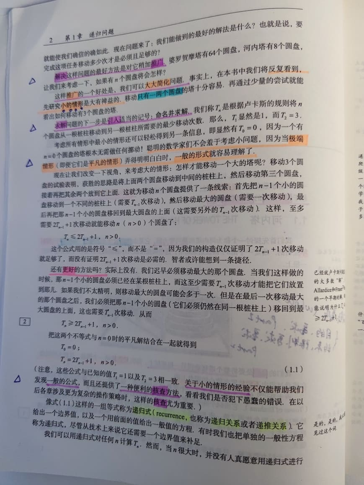

----------------------------------------

内容也发到了[微博](https://weibo.com/1836334682/K9FRSE7Sm)上。

## 多余的『用null初始化』 - 2021-04-02

```java
import java.util.concurrent.ThreadLocalRandom;

public class RedundantInitializerDemo {
    public static void main(String[] args) {
        String s = null;

        if (ThreadLocalRandom.current().nextBoolean()) {
            s = "true";
        } else {
            s = "false";
        }

        System.out.println(s);
    }
}
```


- 为什么这个『用`null`初始化』是多余的，
- 即 为什么删除这个 『用`null`初始化』是安全的？  
    \# 所以`IntelliJ IDEA`提示 警告，并 直接给出 删除的`AutoFix`操作。

### 大家的讨论

- [`@hepin1989`](https://github.com/hepin1989)：
    - 因为下面在所有的执行路径上都进行了赋值。
    - Reply By `@oldratlee`：
        - 还可以进一步回答，比如 为什么 删除 这个赋值 可以更安全？  
          比如 这样 编译器 就可以保证  『所有的执行路径上都赋值了』？
        - 这个不赋值，就像`final`变量修饰符保证了 变量不会再被赋值。
            - 编译器节省了人肉检查（人肉就会出错）。
            - 也是提供了进一步的文档性信息。
        - Reply By `@zavakid`：
            - 不加赋值，就能确保后续会被一定会被复制。
            - 如果后面 因为 bug 遗漏了赋值，编译器就能帮忙检查出来。
    - 去掉`null`，加个`final`，是最安全的。
- `@oldratlee`
    - 严格的讲，对于 上面删除 的是 初始化，不是一般的赋值。
    - 所以 可以声明成 final 变量，分别在`if-else`的2条路径初始化。
    - \# 虽然我们 平时一般不关心 初始化 与 赋值的区别。
    - `Java`及相关语言编译器 记录了 变量是否初始化的状态，以做路径分析，不允许读 未初始化的变量（编译报错）。

## 当你编码时，事物命名 - 2021-03-12

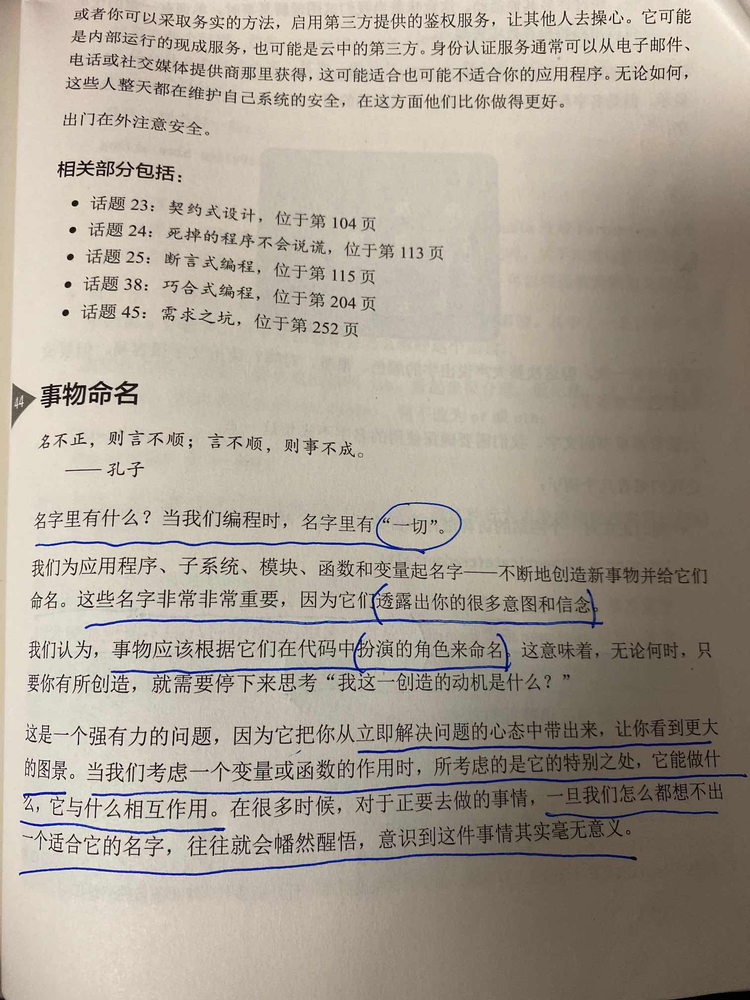
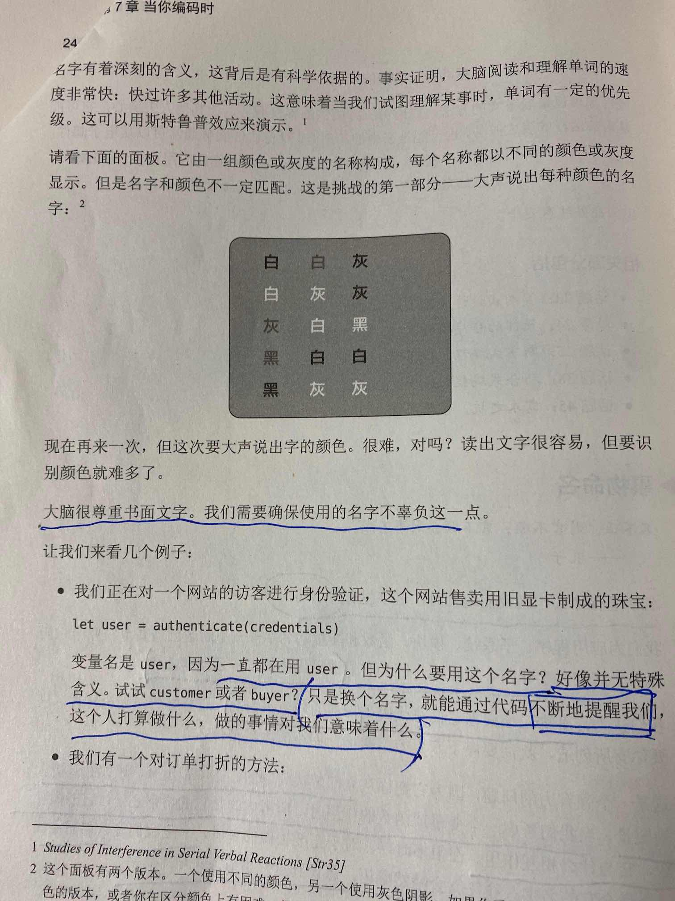  
—— 《程序员修炼之道》第7章 当你编码时 条款44 事物命名 P245

### 大家的讨论

- [`@zavakid`](https://github.com/zavakid)：
    - 所以命名也是最难的事情之一。但还是值得，需要去想
        - 如何给程序中的变量起个好名字？ https://www.infoq.cn/article/t3bgkxio1reigqrw7tgk
          1. 起的名字有意义，可以表达一个概念
          2. 要考虑名字的长度，名称中只有必要信息
          3. 符合“编码规范”，有助于理解
          4. 一个概念不要多个名字混用
          5. 使用在背景领域和上下文中都有意义的名字


## `SICP`作者的新书《面向灵活性的软件设计》 - 2021-03-11

> 《Software Design for Flexibility: How to Avoid Programming Yourself into a Corner》  
> 书名直译《面向灵活性的软件设计：如何避免自己被编排到死角》
>
> 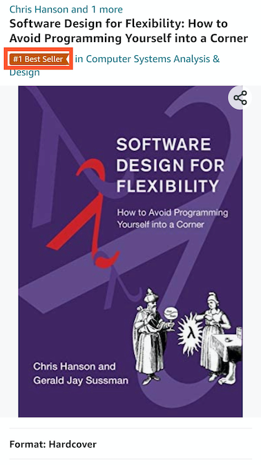  
> https://www.amazon.com/Software-Design-Flexibility-Programming-Yourself/dp/0262045494

- `SICP`作者的书；封面也用的是`SICP`的图；瑟瑟发抖！
- 3月9号刚出版的，已经是『best seller』了。

## 迭代效率之于工程 2021-02-18

> 最近我需要自己修改 Linux kernel 里的一些代码（不是 Linux 内核模块），因为我们的内核工程师一直没搞定，只好亲自出马了。于是我首先琢磨了一下如何实现内核开发的 TDD 测试驱动。
>
> 这里最大的挑战是从修改代码到看到效果中间的延时。最初这里的延时长达几分钟，即使已经使用了 KVM 虚机方式。
>
> 于是我优化了一下 .config 文件和内核的 Makefile（有些更动不能通过 CONFIG_XXX 选项来控制），同时使用 supermin 这样的神器，还有用上了 make localmodconfig 命令，最终把从修改代码到看到测试结果的 turnaround time 缩减到了只有 10 秒多一点（其中编译内核只需 9 秒，启动内核和跑测试只要一两秒）。
>
> 有了这么快的内核开发的迭代速度。我一个晚上就搞定了我们内核工程师一个月也没搞定的内核补丁。开心。
>
> by agentzh 2-16 10:32 https://m.weibo.cn/status/4605174922613334
>
> 有了这么快的内核开发的迭代速度。我一个晚上就搞定了我们内核工程师一个月也没搞定的内核补丁。

或许有夸张的成分；但迭代效率，是工程最重要的事（可能没有之一）。

只要有快的迭代再加上持续改进，一个naive的想法或实现会演变成 有效、极致、稳定的解决方案。

### 大家的讨论

- [`@zavakid`](https://github.com/zavakid)：
    - 迭代加快，试错成本就低，就能尝试更多的想法，有更多的试错机会。

## 公共知识 与 主动宣导 - 2021-01-29

> - 一个关于数学归纳法的悖论问题：到底是第 N 天有 N 个红眼睛自杀，还是什么都不会发生？ - 知乎 https://www.zhihu.com/question/21262930
> - 红眼睛问题——数学归纳法（基础篇） https://zhuanlan.zhihu.com/p/53029086
> - 李永乐老师：《皇帝的新装》 https://v.youku.com/v_show/id_XNDUzNjExNTYzMg==

涉及的经典概念：

- 共有知识（每个人 自己知道的知识，共有）
- 公共知识（共用 & 知道别人知道）
- 即使大家都知道的事，站出来宣导仍然是 至关重要的

PS：

- 这个『红眼睛、蓝眼睛』问题最早据说是澳大利亚的华裔数学神童陶哲轩在网上贴出来让大家思考。
- 《陶哲轩 实分析 第3版》 https://book.douban.com/subject/30227556/

## 谷歌可靠性工程的设计经验 - 2021-01-21

> [谷歌可靠性工程的设计经验](https://mp.weixin.qq.com/s?__biz=MzIzNzU4MTg5NQ==&mid=2247485167&idx=1&sn=84e8688eacca0732cf3d6679f08e1165&chksm=e8c725c7dfb0acd1c9a6c497028e1a6be8757a3f25d77e45418171aa23f7bf1e9c6ccaf421a6&mpshare=1&srcid=0930v6FU0ARo4lXcD9y7cLIl&sharer_sharetime=1569801545094&sharer_shareid=5d48c3632036332790a62e50d19f3dd9&from=timeline&scene=2&subscene=2&clicktime=1611242327&enterid=1611242327&ascene=2&devicetype=android-29&version=2700163b&nettype=WIFI&abtest_cookie=AAACAA%3D%3D&lang=zh_CN&exportkey=ASjgNHEbqMTJxE9q7Kb%2F9bk%3D&pass_ticket=4NHvAqJRB%2BX95iPCw8k8BGV%2FFZ6XnNUcltGK7K%2FfVV7ISzV%2Bsk%2Fj6INL14b83TaY&wx_header=1)
>
> 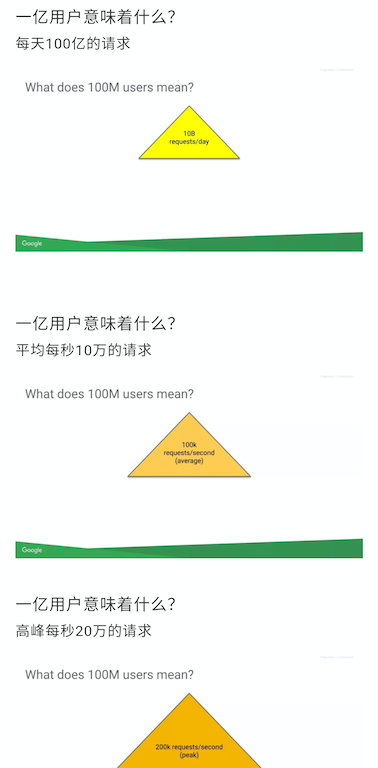

- 给了个经验值/估算：
    - 100M用户，100K QPS（3量级差），200K高峰QPS（这个我国应该不合）
- 从qps的角度跨天的用户总量和qps几乎没有相关性
- QPS ~ DAU ~ MAU（xD AU）
    - 或者说 MAU、DAU 比值是个变量 反映 一个用户使用频度（粘性）

## Magic Go Lang! - 2021-01-18

> Why we moved from Kotlin & Spring Boot to Go  
> https://blog.astradot.com/why-we-moved-from-kotlin-spring-boot-to-go/
>
> 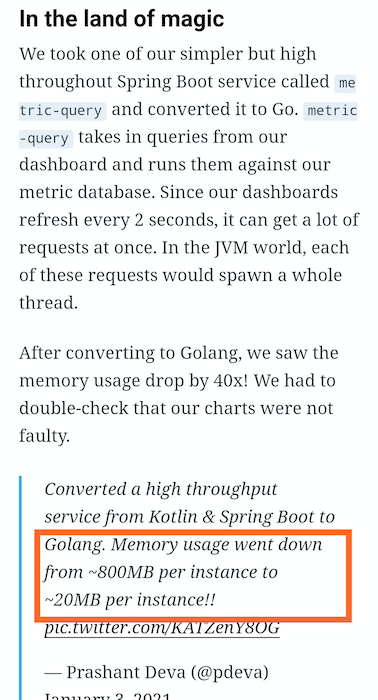

按这样`magic`式的大众鼓吹风下去，`Java`要死：

> The latency graph almost feels like it disappears after the switch.
>
> Memory usage went from 3.1GB to 125MB!
>
> continued converting each microservice from Kotlin/Spring Boot to Go and its magical each time watching those graphs drop.
>
> ……


### 大家的讨论

- [`@hepin1989`](https://github.com/hepin1989)：
    - 等：https://openjdk.java.net/projects/valhalla/ 来拯救我们
    - 然后kotlin也加入了：https://kotlinlang.org/docs/reference/inline-classes.html ，类似scala的value class，这样抽象的时候也不至于浪费太多内存。
    - https://quarkus.io  
        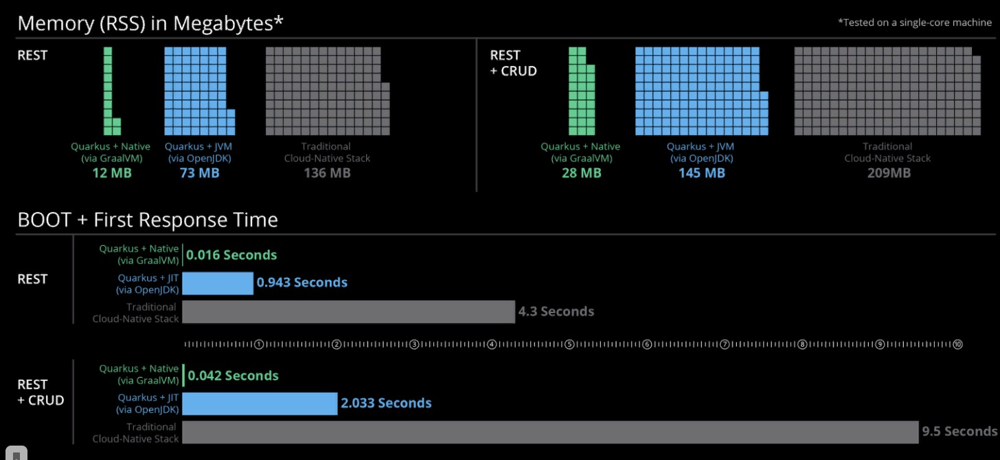
        - Reply By `@oldratlee`：
            - 这个5倍的差别，上面magic 40倍的差别
    - comments:
        1. Instant compile times and program startup for faster development
            - 这个暂时无解 ，可能bazel
        2. Virtual threads for dealing with high concurrency workloads
            - Loom 还在开发中，或则Akka actor、Kotlin的协程
        3. Value types to better control memory usage
            - Project valhalla
    - 当然还有更夸张的Rust粉呢，Rust粉还说Golang也还有GC不行呢
