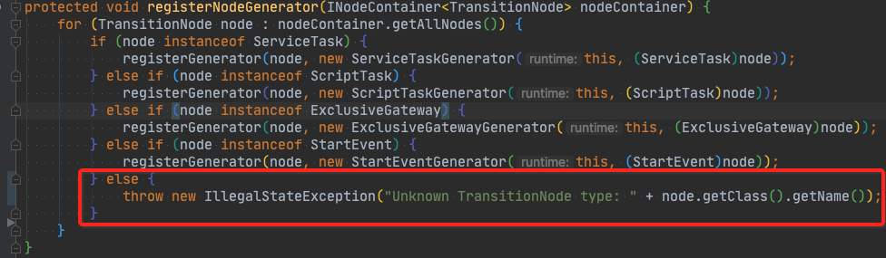
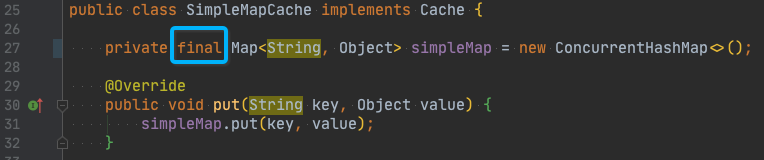
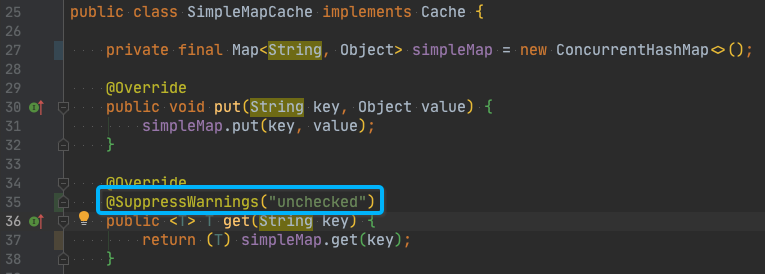
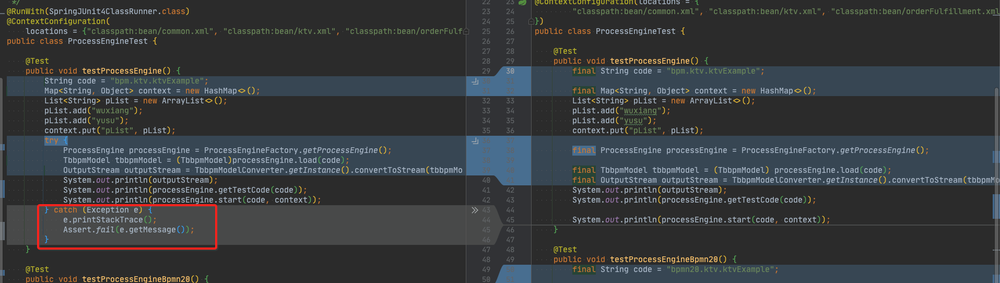

# `compileflow`开源项目的代码review

## 🍎 序

有幸受邀[`@voff12`](https://github.com/voff12) Review `compileflow`，写于 2020-08-02。

- Review与交流讨论的过程 是自己整理学习的过程。
- 大部分的整理内容 其实是独立于具体的一个开源项目。

所以觉得值得整理出来。

下面是Review的内容记录。

-------------------------------------------------

<!-- START doctoc generated TOC please keep comment here to allow auto update -->
<!-- DON'T EDIT THIS SECTION, INSTEAD RE-RUN doctoc TO UPDATE -->

- [0. Review内容说明](#0-review%E5%86%85%E5%AE%B9%E8%AF%B4%E6%98%8E)
- [1. 产品开源的用户体验](#1-%E4%BA%A7%E5%93%81%E5%BC%80%E6%BA%90%E7%9A%84%E7%94%A8%E6%88%B7%E4%BD%93%E9%AA%8C)
- [2. 代码实现](#2-%E4%BB%A3%E7%A0%81%E5%AE%9E%E7%8E%B0)
    - [2.0 文档](#20-%E6%96%87%E6%A1%A3)
    - [2.1 代码可靠性](#21-%E4%BB%A3%E7%A0%81%E5%8F%AF%E9%9D%A0%E6%80%A7)
    - [2.3 专业性（命名/拼写、Warning etc）](#23-%E4%B8%93%E4%B8%9A%E6%80%A7%E5%91%BD%E5%90%8D%E6%8B%BC%E5%86%99warning-etc)
- [3. 系统设计](#3-%E7%B3%BB%E7%BB%9F%E8%AE%BE%E8%AE%A1)
    - [3.1 按系统(子)领域/模型拆分](#31-%E6%8C%89%E7%B3%BB%E7%BB%9F%E5%AD%90%E9%A2%86%E5%9F%9F%E6%A8%A1%E5%9E%8B%E6%8B%86%E5%88%86)
        - [3.1.0 拆分原则说明](#310-%E6%8B%86%E5%88%86%E5%8E%9F%E5%88%99%E8%AF%B4%E6%98%8E)
        - [3.1.1 实践推论](#311-%E5%AE%9E%E8%B7%B5%E6%8E%A8%E8%AE%BA)
        - [3.1.2 可能涉及的问题](#312-%E5%8F%AF%E8%83%BD%E6%B6%89%E5%8F%8A%E7%9A%84%E9%97%AE%E9%A2%98)
        - [3.1.3 涉及的Action](#313-%E6%B6%89%E5%8F%8A%E7%9A%84action)
        - [3.1.∞. 关于API](#31%E2%88%9E-%E5%85%B3%E4%BA%8Eapi)
    - [3.2 扩展设计](#32-%E6%89%A9%E5%B1%95%E8%AE%BE%E8%AE%A1)
        - [3.2.0 关于 SPI（扩展）vs API](#320-%E5%85%B3%E4%BA%8E-spi%E6%89%A9%E5%B1%95vs-api)
        - [3.2.1 关于扩展的包设计](#321-%E5%85%B3%E4%BA%8E%E6%89%A9%E5%B1%95%E7%9A%84%E5%8C%85%E8%AE%BE%E8%AE%A1)
        - [3.2.2 关于扩展的依赖管理](#322-%E5%85%B3%E4%BA%8E%E6%89%A9%E5%B1%95%E7%9A%84%E4%BE%9D%E8%B5%96%E7%AE%A1%E7%90%86)
- [4. 工程实践](#4-%E5%B7%A5%E7%A8%8B%E5%AE%9E%E8%B7%B5)
    - [4.1 通用工程实践](#41-%E9%80%9A%E7%94%A8%E5%B7%A5%E7%A8%8B%E5%AE%9E%E8%B7%B5)
        - [4.1.1 发布版本管理](#411-%E5%8F%91%E5%B8%83%E7%89%88%E6%9C%AC%E7%AE%A1%E7%90%86)
        - [4.1.2 VCS](#412-vcs)
        - [4.1.3 构建](#413-%E6%9E%84%E5%BB%BA)
    - [4.2 Java相关的工程实践](#42-java%E7%9B%B8%E5%85%B3%E7%9A%84%E5%B7%A5%E7%A8%8B%E5%AE%9E%E8%B7%B5)
    - [4.3 软件测试](#43-%E8%BD%AF%E4%BB%B6%E6%B5%8B%E8%AF%95)
        - [单元测试（UT）不用做Try-Catch-Fail来断言出异常](#%E5%8D%95%E5%85%83%E6%B5%8B%E8%AF%95ut%E4%B8%8D%E7%94%A8%E5%81%9Atry-catch-fail%E6%9D%A5%E6%96%AD%E8%A8%80%E5%87%BA%E5%BC%82%E5%B8%B8)

<!-- END doctoc generated TOC please keep comment here to allow auto update -->

-------------------------------------------------

## 0. Review内容说明

> Open Source Projects：
>
> - [`git@github.com:alibaba/compileflow.git`](https://github.com/alibaba/compileflow)
> - [`git@github.com:alibaba/compileflow-idea-designer.git`](https://github.com/alibaba/compileflow-idea-designer)
>
> 注意：**下面这些整理的是我想到的内容，未必高优先级；根据项目紧急与重要性的实际情况跟进  :")**
>
> 相关资料，个人做的分享整理：
>
> - 分享PPT：[开源漫游者指南：开源的工作内容与要点](../hitchhikers-guide-to-open-source/开源漫游者指南-v0.9.1.pptx)
> - 分享PPT：[Git/VCS 使用与原则 简介](../git/git-usage-and-principle-v0.3.pptx)
> - 分享PPT：[软件可靠性设计的实践](../practice-of-software-reliability-design/软件可靠性设计的实践-v0.9.1.pptx)

## 1. 产品开源的用户体验

- 提供一个Quick Start的极简Demo
    - 如果工程足够简单，可以放在 对应工程模块的**test目录的demo包**下
        - 目前`compileflow`就只有 单工程模块，挺好的 :")
    - 并在 README文档 中引导用户对查看 这个Demo，方便用户快速运行与上手理解
    - 示例，参见`TransmittableThreadLocal`的
        - 提供的Quick Start的[极简Demo](https://github.com/alibaba/transmittable-thread-local/tree/master/src/test/java/com/alibaba/demo/ttl)
        - 文档引导：[完整可运行的Demo代码参见SimpleDemo.kt](https://github.com/alibaba/transmittable-thread-local#1-%E7%AE%80%E5%8D%95%E4%BD%BF%E7%94%A8)

## 2. 代码实现

如 代码的可读性/简洁性、可靠性、专业性、etc

### 2.0 文档

1. （核心）**接口要有完整ApiDoc**（如`ProcessEngine`）。尤其不要漏了下面的这些内容：
    - 通过JavaDoc的`@throws` 说明好：什么情况出什么异常？
    - 输入输出的要求。如参数/返回值 是否为null？
        - 推荐使用 [`spotbugs-annotations`依赖](https://github.com/alibaba/transmittable-thread-local/blob/2fa0cdb3dfed6de0048a0a3f78e8efda7423b96e/pom.xml#L108-L119) 与 [`spotbugs-maven-plugin`](https://github.com/alibaba/transmittable-thread-local/blob/2fa0cdb3dfed6de0048a0a3f78e8efda7423b96e/pom.xml#L539-L554)，提供编译时的自动检查能力。
        - 配置方式 参见上行的链接。PS: `spotbugs`能做的检查远不止 像`@NonNull`空值检查。
    - 通过JavaDoc的`@since` 说明好：这个类/方法从哪个版本开始支持？
        - 支持版本信息 对基础`SDK`/服务 至关重要，因为涉及功能的新增与兼容性。
    - 像接口/方法的基本功能解释 往往不会漏了 :")

### 2.1 代码可靠性

1. **对于分情况的处理逻辑（`if-else if-ELSE`/`switch-case-DEFAULT`），要遍历尽所有情况。**
    - 对于不可能出现的情况，需要报错Fast-Fail（如 抛异常） （By @WuXiang ）
        - 避免掩盖问题，带病运行。
        - 及时报错（如抛异常） 可以提供 显式的错误说明。  
          而带病运行的出错往往已经不知道什么直接业务原因了（答非所问了），排查困难。
        - 如果有**充分理由**不『遍历尽所有情况』，
            - 则在`else/default`位置上，注释代码以解释好理由。
            - 避免看代码人的可靠性疑虑（是真不需要`else`，还是没有去考虑而逻辑有缺失）。
        - 示例，如下：  
        
2. **不要 默默吃掉异常，不做任何操作（如Wrap异常重抛出、日志汇报、恢复）。**
    - 如果有**充分理由**『吃掉异常不做任何操作』，
        - 则catch位置上，注释代码 以解释好理由。
        - 避免看代码人的可靠性疑虑（是异常真可以忽略，还是没有去考虑而逻辑有缺失）。
    - 示例，如下：  
    
    1. 这条没有发现明显的问题。
3. **能使用`final`的情况下，尽量加上`final`。** 无论字段还是局部变量。（这条优先级/重要性低 :")。原因：
    1. `final`有保证不会改变的语义：减少出错（意外修改）；方便逻辑推理，提升代码可读性。
    1. `final`字段有**并发**语义，可以提升程序并发的安全性。（并发是个大主题，这里不展开:")  
    

### 2.3 专业性（命名/拼写、Warning etc）

1. **命名**。如大小写/拼写 etc。
    - Inword（连单词）
        - 如 **`Compile*f*lowException -> Compile*F*lowException`**
    - 不要缩写。可读性优先；且现代化的IDE自动补全能力让编码键入几乎没有成本。
        - 如，`EncodingConsts` -> `EncodingConstants`
2. **代码Warning**。期望**0 Warning**。如泛型、转型操作的代码Warning。
    - 泛型类/接口 缺失了 泛型参数
        - **主接口** `interface ProcessEngine<T extends FlowModel<??>>` 缺失了
        - 还有很多接口/方法 :")
    - 转型操作
        - 转型操作Warning，在 确定是安全且不得不的情况下， 使用 `@SuppressWarnings("unchecked")`    
        
3. **拼写错误**
    - 如，`DEF*UA*LT_JAVA_SOURCE_VERSION` -> `DEF*AU*LT_JAVA_SOURCE_VERSION`

## 3. 系统设计

如系统领域/模型、模型对应的分包等等。自然也是提升系统实现/代码实现的 可读性/简洁性、可理解性 etc。

### 3.1 按系统(子)领域/模型拆分

#### 3.1.0 拆分原则说明

- **设计原则**：按系统(子)领域/模型拆分，各个 **(子)领域** 自包含(self-contained)。
- 与之对应的**实现原则**：从设计对应到代码上，(子)领域的API的**Java包**自包含(self-contained)。

一个领域涉及的概念（如`POJO`、异常类、错误码、常量）应该不多的；尽量分拆进入其对应子领域。

**人脑认知在一个抽象层次 能玩转的概念个数 很有限（<=7个，最好<=5）。**

概念个数的经验法则，

- 适用于一个域自身透露的概念个数（对外的展现）
- 也适用于 **一个域下涉及的子域个数**（对内的分解）

在效果上的结果/要求，就是尽量下拆职责，以期望形成 [**窄接口 深模块**](https://macsalvation.net/a-intensive-reading-of-a-philosophy-of-software-design/)：

- **窄接口：** 上层域（是下层支撑的接口）内容尽量少，不要涉及 下层的（细节）内容
- **深模块：** 下层支撑域个数限制，层次可以多

[**窄接口 深模块**](https://macsalvation.net/a-intensive-reading-of-a-philosophy-of-software-design/)的收益是 使用、理解的成本低，得到期望的 **高ROI抽象**。

可以看到，**抽象/系统设计/建模**的**优秀程度** 通过 **模块形状**的**窄深程度** 来判断。

可能被无视/反直觉的常识 值得单拎出来强调：

接口是成本！  
用户调用接口是成本！！  
用户调用接口是使用成本！！！  
（没有接口无需调用就能解决问题，那是最好的了。Woo~ 🤥 😂 ）

PS: 深模块 一词来自书《[A Philosophy of Software Design](https://book.douban.com/subject/30218046/)》： 

#### 3.1.1 实践推论

原则『按系统(子)领域/模型拆分，各个 **(子)领域**自包含』的**推论**：

- **不要** 面向**技术方式/特征**来划分包，而是面向**业务域**的方式拆分。
    - 如`exception`、`contants`、`model`、`(error)code`这样的包名   
      像是不是异常、常量，这些是技术特征。应该**尽量分拆入其对应(子)领域。**
    - 面向技术独立包 会导致
        - 与业务域（要解决的问题）关联不强的**孤立技术类**。这样的代码孤立感来自：
            - 与使用它的对应域的类远了
            - 域代码文件没有一目了然地排在一起。
        - 因为按技术划分，只是看起来包下的类变少了，实际上是
            - **掩盖**了 业务域下拆不足的问题
            - **阻碍**了 领域拆分梳理优化的持续演进
    - 以 异常 为例，说明 一下按业务域下拆：
        - 子异常 `CompileFlow*Parse*Exception` 则属于子域（即子包 `compileflow.engine.transformer.converter.*parser*`）。
        - 根异常 **`CompileFlowException`** 属于 根域（即根包 `com.alibaba.compileflow`）。
            - 在根域（即根包 `compileflow`）只关心 `CompileFlowException`
            - 概念上（即根域API）并 不需要/不应该 关心其子域异常（如更具体的子类异常 `CompileFlowParseException`）。
- **一个域包下类**太多 或 **一个域包下的子域包**太多，则需要做 **领域拆分**梳理优化。
    - 如果一个域包下类太多了（如`Model`、异常、常量类），  
      则应该思考一下 **自己本身的领域拆分** 是不是梳理优化了？
    - 如果一个包下的子包太多了，
      则应该思考一下 **子领域的领域拆分** 是不是要梳理优化了？
        - 因为分形下拆，一个包下的子包不会/不应该太多，而一个包/业务域的支撑域不会/不应该太多。

#### 3.1.2 可能涉及的问题

- 太厚的包（领域拆分不足？）
    - **com.alibaba.compileflow.common**
        - 包含了 面向技术的分包，如
            - com.alibaba.compileflow.common.**exception**
            - com.alibaba.compileflow.common.**code**
            - com.alibaba.compileflow.common.**consts**
            - ……
        - 是不是可以按拆解到对应的子域？
    - **com.alibaba.compileflow.engine.transformer.model.bpmn**
        - 是不是可以进一步抽象拆解领域？
- `compileflow`**内部/自己的**使用的包推荐放到`internal`包下。如
    - com.alibaba.**compileflow.common**.script -> com.alibaba.**compileflow.internal.common**.script
    - com.alibaba.**compileflow.common**.cache -> com.alibaba.**compileflow.internal.common**.cache
    - 业务使用 **`internal`**包来 表义/声明：
        - 内部使用的内容，自己会改，没有使用的兼容性保证。
        - 用户使用不要依赖。用户使用产品时，也并不需要理解这些内容。
- compileflow.common.utils.`VarUtils` 是不是可以放到 肯定只有engine应该使用的 compileflow.engine 包下？（按域下拆）
    - 看到了common包 依赖了 业务包：  
      VarUtils -> com.alibaba.compileflow.`engine.transformer.model.bpmn`.FlowElement;

#### 3.1.3 涉及的Action

- `CompileFlow*Exception`，放到`compileflow`根包（业务领域）下。
- `compileflow.engine.transformer.consts.ActionType` 放到其使用根包（业务领域）下。
    - 使用的类是compileflow.engine.transformer.converter.parser.bpmn.ServiceTaskParser
    - 而 transformer.consts.ActionType 在概念上 是  
      属于 **上层的子域** compileflow.engine.transformer.converter.**parser**？  
      还是 **更下层的细子域** compileflow.engine.transformer.converter.**parser.bpmn**？

#### 3.1.∞. 关于API

- API包含哪些内容（即 都放在**自己域的根包**下的内容）：
    - API的(Java) **接口/方法**
    - (Java)接口方法涉及的 **POJO类**，表达了这个域输入输出的数据（正常情况）。
        - 对应目前的实践是 放在了 model 子包下。多了一次远跳的代码查看/理解的成本。
        - **如果一个域根包下类太多了（如Model类），则应该思考一下领域拆分是不是要优化了？**
    - (Java)接口方法涉及的 **异常类**，表达这个域的出错情况。  
      正常（`POJO`）/出错（异常）情况的输入输出类 等同重要。
    - 涉及的这些实现类的序列化形式（因为用户使用关注这些实现类序列化所引发的兼容性问题）。
      这一点 现在可能 相对不怎么关注了 😂
- 详见 《[Effective Java](https://book.douban.com/subject/30412517/)》

### 3.2 扩展设计

#### 3.2.0 关于 SPI（扩展）vs API

**SPI**（Service Provider Interface，即扩展）与 **API**（Application Programming Interface）对应。

- SPI 与 API 都是 Interface。
- **SPI**：
    - 用于，在不修改框架/库的情况下，替换/追加 框架/库内部组件的实现。
    - 面向角色、用户是 框架的（三方）开发者。  
      三方开发者，是指 非框架的开发者，即不能、没有权限去修改框架/库本身的代码。
- **API**：
    - 用于暴露框架/库 的业务功能。
    - 面向角色、用户是 框架外部的业务用户、使用者。
- 广义上讲，SPI 是 API的一种。
- **API 与 SPI的区别**：
    - SPI 用户是 内部（框架开发者）；API 是外部的（框架使用者）。
    - 如果内部的接口，且能 （在运行时、编译打包时）**替换/追加 组件实现**，就称之为**扩展**。

#### 3.2.1 关于扩展的包设计

**一般扩展/SPI 在包名 不需要 特殊对待。**

- 因为 扩展/SPI 是框架的内部组件，即就是『3.1』节说的 子域/包拆分。
- 即 扩展/SPI 在包名上 一般情况并不需要在包名上特殊对待，按域拆分即可。

**什么情况下，扩展/SPI 需要显式的`spi`包名？**

- 有一些内部开发者对象：
    - 需要加到 **API的对象**上（业务用户使用的对象）
    - 且 与API在同一个域（即这些对象 不能有 有不同的自己域包）
- 对于这些对象（暂称为 **_SPI隐藏对象_**），为了
    - 尽量减少 业务用户的理解/使用干扰；如避免在API域包被业务用户过于方便地翻到/自动补全出来。
    - 表义 是内部对象，业务用户 在使用时 可以不用关心。
- 这时，可以使用一个显式的`spi`包名。
- **注意**：对于比较复杂的框架/库，上面 **_SPI隐藏对象_** 往往没有理由出现，因为可以有丰富的子域结构。

**示例**：

- `Dubbo`框架：有大量的扩展（80+个），并没有使用显式的`spi`包。
- 显式 `spi`包的示例：[alibaba/transmittable-thread-local - spi包](https://github.com/alibaba/transmittable-thread-local/blob/master/src/main/java/com/alibaba/ttl/spi/) 里面就是 用于加到API对象的一些类，但只有 框架开发者 才关心的类。

#### 3.2.2 关于扩展的依赖管理

比如`compileflow`中的 `compiler扩展(EC/JdkCompiler)`：

- 依赖极简
    - **核心/基础库 依赖 要极简**
    - 如果可能，选一个扩展作为缺省，对于缺省扩展要求能 开箱即用。
        - 即缺省扩展 依赖要带好，compile非Provided，其它的compiler选成Provided。
- 缺省扩展的选择原则：各个关注点的优先级如下：
    - **使用方便、可开箱即用**。即用户方便地不需要额外加依赖。（JDK实现因为自带依赖会有优势）
    - **稳定性**好
    - **性能**好  
      性能，这个关注点对于缺省扩展来看，优先级往往是最低的；高级用户 有能力为性能自己定制。

## 4. 工程实践

### 4.1 通用工程实践

如软件版本发布管理、构建、VCS，etc。 

#### 4.1.1 发布版本管理

- 使用业界的3位语义化版本：compileflow-process 1.0 -> 1.0.0
    - 1位升级 表示 不兼容的大版本，2位升级 表示 新功能新增，3位升级表示 BugFix之类。
    - 后缀 `RC` 表示 **非稳定版本**，一般用于1位、2位版本， 如 `1.3.0-RC1`
    - 详见 [语义化版本 2.0.0 | Semantic Versioning](https://semver.org/lang/zh-CN/)
    - PS: 看到`pom.xml`已经用的是三位版本号 `1.1.1-SNAPSHOT`，只是在`README.md`还有二位版本的示例。
- 第一对外发布的版本推荐使用 `1.0.0`，甚至更低的`0.9.x`版本，这样比较有正式感 & 仪式感。
    - 原因：
        - `1.0.0`版本，表示专门为开源做的首个正式可用的版本；
        - 而`0.9.x`版本，表示为开源版本是准备要上心打磨的。
    - PS：看到 开源工程`compileflow`中，还有没有打过的 发版的Tag，但开源代码中的版本已经是 `1.1.1-SNAPSHOT`，非`1.0.0`。

#### 4.1.2 VCS

- **不要** 源码Git工程中 包含 二进制大文件，如`compileflow.idea-3.0.zip`
    - 可以通过 下面的方式 来保存 构建的衍生物/发布物
        - **Github的Release页**。在Release页可以上传（构建）文件。  
        示例： [https://github.com/lihaoyi/Ammonite/releases/tag/2.2.0](https://github.com/lihaoyi/Ammonite/releases/tag/2.2.0)
        - **Maven 的 Deploy**。Maven的发布可以随带部署构建的二进制发布物。  
        示例：[https://repo.maven.apache.org/maven2/org/apache/maven/apache-maven/3.6.3](https://repo.maven.apache.org/maven2/org/apache/maven/apache-maven/3.6.3) `/apache-maven-3.6.3-bin.zip`
    - **改正方式**：
        - 通过使用`git-filter-repo`工具来修正仓库历史。
    - 原因，代码库/VCS 是
        - 大家频繁修改、更新的地方，要快；大文件让`clone`、查看等操作 都变慢了
        - 是追踪变更的源文件的地方。构建的衍生物（如上面的二进制大文件） 不值得在 VCS/代码库中 浪费这样更珍贵的资源。
        - **一个上百兆的代码库 是 实践反模式。**

#### 4.1.3 构建

- 工程自带 构建工具的`Wrapper`，对于 Maven即是 `mvnw`
    - 这样做的**好处**：
        - 用户 使用方便 & 确定性：
            - 确保 **用户**使用正确版本的构建工具 **成功**完成构建。
            - 用户 不再需要 自己手动安装 Maven。
        - 持续集成（`CI`）确定性：
            - 保证  的 基线 也包含了 构建工具（的版本）。过老版本的构建工具往往构建可能失败。
    - `Maven Wrapper`的**生成方法**：
        - `mvn -N io.takari:maven:0.7.7:wrapper -Dmaven=3.6.3`
    - 示例： [`alibaba/transmittable-thread-local`](https://github.com/alibaba/transmittable-thread-local)/`{mvnw, mvnw.cmd, .mvn}`

### 4.2 `Java`相关的工程实践

如 Java生态的Maven，etc。

- 不要使用 父`POM`：`com.taobao:parent`
    - 这样做的**好处**：
        - 减少依赖，让自己极简
        - 作为一个独立项目，也不需要 这个`taobao`父`POM`中的约定
- 生产代码依赖了测试库。是不是 不应该？
    - 生成代码 编译依赖了测试库
        - `junit:junit`（虽然scope是provided）
        - `org.springframework:spring-test`
    - 即生产代码依赖了。

### 4.3 软件测试

#### 单元测试（UT）不用做`Try-Catch-Fail`来断言出异常

原因：

1. 出异常的测试Case，`JUnit`会打出异常信息，并且 是 失败的。  
    即 自然是合要求的
2. 这样的`Try-Catch`是 代码噪音（影响测试逻辑的一目了然）。  
    

更多关于 UT/JUnit 的最佳实践，可以看看比如 《[JUnit实战 : 第2版](https://book.douban.com/subject/10561424/)》
