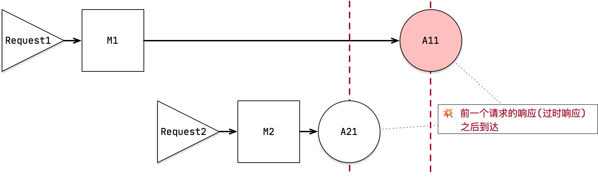
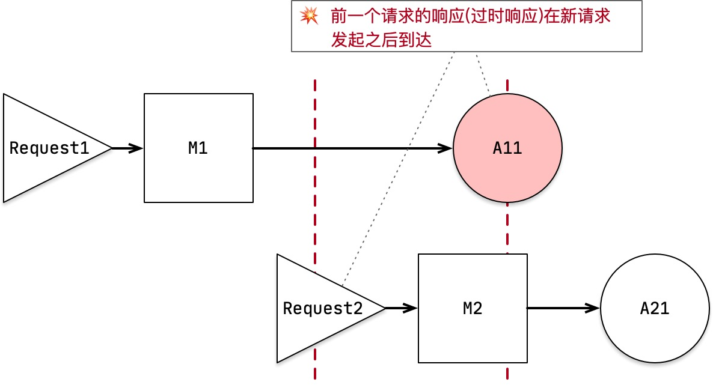

> 写于 2021-04-13。

# 多响应异步请求模式下需求满足的分析模型

# 〇、多响应异步请求模式下请求过程的描述方式

先说明一下请求过程的描述方式。请求过程可以描述成：

> 本文用图的[源文件](graphs.graffle)

对于多个请求，依序类推编号：

- **`Request2`**：第2个请求
- **`M2Local`**：第2个请求的本地主响应；**`M2Remote`**：第2个请求的远程主响应
- **`A21`**: 第2个请求的第1个副响应；**`A22`**: 第2个请求的第2个副响应

# 多响应请求模式的分析模型

## 1.1 请求的3个关注维度：`CRC`

- **完整性**（**`Completeness`**）
   - 指 获取到的数据 是否与 实际的**数据条目数**一致，是否是完整的。  
     比如，总共有10条数据，10条全取到？只取到9条？
   - 注：在思考交流过程中，完整性 也会想到/说成『一致性（`consistency`）』。这里不使用『一致性』这个用语的原因是：『一致性』也常指 数据是否正确性，会与后面的『正确性』形成歧义。
- **响应性（**`Responsiveness`**）**
   - 指 **用户等待时长** / **返回时延**（RT）。
   - 关于**跳变**：多响应异步请求模式下，在用户体验上，大家会提到的 一个关键关注问题。
      - 视觉跳变/UI跳变，即 开始时没有显示一个UI组件，过会儿数据来了又显示了（如特价飘条、相关商品推荐随手加购的UI控件）。
      - 跳变 可以理解成：全部的数据中，有一部分的数据获取/展示的时间更长。  
        即 跳变 可以统一化归为 (局部)数据的RT问题。
   - 注：在思考交流过程中，响应性 也会想到/说成『用户体验（`user experience`）』。这里不使用『用户体验』这个用语的原因是：
      - 体验是个心理感受的逻辑，不是一个数据定性定量的逻辑。**体验满意度 = 期望体验 - 实际体验。**  
        比如 期望(1秒打开、价格直观……)  **-**  实际(3秒打开，价格复杂……) 。
      - 体验是用户与产品接触点的事实情况的感知；其中包含用户期望部分往往独立于技术的分析与实现。
      - 体验除了用户期望的主观类的部分（技术+心理），另外广义上来说，完整性、正确性的好坏也一样会影响用户体验，即体验用语 可以理解成 一个宽泛综合的结果（响应性+完整性+正确性）。
- **正确性（**`Correctness`**）**
   - 指 **数据的值** 是否正确的，是不是过时的。
   - 注：在思考交流过程中，正确性 也会想到/说成『错误容忍（`fault tolerant`）』。这里不使用『错误容忍』这个用语的原因是：『错误容忍』常用于表达系统稳定性/可用性，而不是数据的正确性。

## 1.2 `CRC`也是请求的平衡维度

所谓平衡是指：当不可兼得时，可互相置换。

**请求所关注与平衡的CRC维度模型 也一样适用于 同步请求模式，并不耦合 多响应异步请求模式。**

只是多响应异步请求模式下的复杂性，在分析上对请求维度模型的需要变得迫切了。

我们可以用请求维度`CRC`模型作为 引入多响应异步请求模式后对产品/用户体验的优化程度 的一种度量方式。

多响应/异步的模式下，相对于传统的同步模式，可以为业务提供了更灵活方便的策略，如

- 放弃一些数据完整性：对非顶级功能的数据，可以引入一定的等待时间（体验），等待超时后不则展示。  
  即可以用一些`RT`(体验损失) 和 完整性 来换 无跳变的体验提升。
- TODO etc etc ……

## 1.3 为什么`CRC`是关于请求完备的关注与平衡维度

从外部观察来请求响应的数据获取：

- 首先是，**数据有没有获取到**，完整性问题
   - 在多响应异步请求模式下，可以更方便地选择获取部分数据，其中顶级功能的数据是最必需的。
- 对于获取到的数据：
   - 数据是不是正确的，正确性问题
   - 数据的获取花了多长时间/用户等待了多久，响应性问题。

至此，数据获取的观察过程结束。

# 二、问题

## 2.1 请求多返回/异步化模式带来的`UI`跳变问题

因为异步化返回副响应，可能在主响应之后返回。业务会表现出 视觉跳变/UI跳变。

**视觉跳变/UI跳变**，即 开始时没有显示一个UI组件，过会儿又显示了（如特价飘条、随手加购UI控件）。

由上面说明可以看出，出现跳变，与是否多个请求无关。  
一个请求时也一样会出现跳变；当请求的副响应是主响应之后返回时，就会出现跳变。

对于**一个请求**，说明 跳变过程如下：

1. 请求的主响应返回，展示上屏，不包含特价飘条的数据，不显示 特价飘条
1. 副响应返回（包含如特价飘条的数据），上屏展示 特价飘条
   1. 跳变（开始时不显示 过会儿显示了特价飘条）

跳变（开始时**不显示**过会儿**又显示**了）是个 体验不好的点。  
作为一个 响应性问题（见上文请求维度分析），解决的策略有：

- **通过正确性来置换；如可以通过 打底数据 来 解决跳变的问题。**打底数据 比如用上次请求的返回的数据。
   - 打底数据 是 过时数据（当前请求返回的响应数据才是最新的正确），带来了正确性问题。
- **通过完整性来置换；如放弃这个数据/组件的显示可以**。
   - 实际实现上可以更细腻一些：可以引入一定的等待时间（体验），等待超时后不则展示。

关于 **通过正确性来置换**：  
展示 过时不正确的数据，业务上可能有严重问题与影响。  
比如 副响应展示的优惠券：

- 前一次请求的响应，优惠是100元
- 调整选购的商品列表后，优惠是30元。
- 如果显示了 优惠100元（避免跳变），一段时间内不正确，用户下单了，就会带来舆论问题。
   - 考虑到副响应是可能丢的（即正确的『优惠是30元』不会返回以更新展示正确），  
     可能一直显示的是错误的『优惠100元』。

## 2.2 多个请求的响应时序引发的相关问题

`Request`模块 解决了是一个请求的主副响应之间的时序问题。  
仍需要解决下面的多个请求之间的问题。

### 2.2.1 多个请求之间副响应时序不可控引起的冲突问题

目前的需求，多个请求的主响应一定不存在数据冲突的问题：

- 要么，操作是独立的，即请求的响应（主响应&副响应）是无关数据
- 要么，在业务侧通过请求阻塞的方式，保证了2个请求的主响应之间是有序的

**副响应的返回时序是无法保证的**。  
当 前一个请求的副响应可以在后一个请求的副响应 之后返回 时，会需要带来下面问题：
> 按上面请求流程描述方式，即是 `**A1x**` 在 `**A2x**` 之后返回。

对应的多个请求及其响应的时序如下：

> 因为不涉及多个主响应引起的问题，上面的示意图中，主响应简化成一个；副响应简化成一个。

如果2个请求的副响应的数据之间是冲突的，前一个请求的副响应（过时响应）生效了导致冲突。

- 后一个请求来了后，前一个请求的副响应是过时的不能再用（如上屏）。

带来业务问题/Bug。  
**需要丢弃过时响应（之前请求的副响应）以避免上面的问题。**

### 2.2.2 主响应数据覆盖上一个请求副响应时显示跳变的问题

例：奥创回收场景(购物车勾选)场景，上一个请求的副响应（过时响应，如特价飘条的副响应、`A11`）在 当前请求（`R2`）或它的响应（`M2`、`A21`）之后到达，有数据冲突（不正确性）与 跳变问题。

1. 展示第二个请求的主响应(`M2`)，不包含特价飘条的数据，不显示 特价飘条
1. 上屏上一个请求的副响应（`A11`，包含特价飘条的数据），显示 特价飘条
   - 不是当前上屏了的主数据对应的副响应，数据不正确
   - 跳变（开始时**不显示**过会儿**又显示**了特价飘条）；注意跳变问题，一个请求时也会发生。
3. 上屏当前一个请求的副响应（`A21`，包含特价飘条的数据），显示 特价飘条：
   - 变化，因为 2份副响应数据不相同

对应的多个请求及其响应的时序如下：

> 因为不涉及多个主响应引起的问题，上面的示意图中，主响应简化成一个；副响应简化成一个。

对于过时响应（`A11`）是否上屏 **只有**2种选择：上屏 or 不上屏。

- 如果 上屏
   - 减少了 特价飘条的空窗时间。
   - 上屏了一份 不正确的数据。
      - 为保证数据正确性，用当前请求的响应肯定要覆盖是合理的，主响应的业务组件数据必须再次下发数据对前序副数据做替换。
- 如果 不上屏：
   - 数据保证一直是正确的。
   - 特价飘条的空窗时间变长。

### 2.2.3 多个请求的响应时序的问题总结

可以看到上面的2个问题，都是 过时响应（之前请求的副响应）引起问题的2种情况。

> 其实**只有**上面的2种情况：
>
> - 过时响应，在当前请求对应副响应（A21）之后返回（问题1）。
> - 过时响应，在当前请求的副响应（A21）之前 & 当前请求（Request2）发起之后返回（问题2）。

总结：之前请求返回的辅响应，都属于过时响应。
