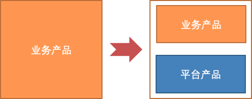
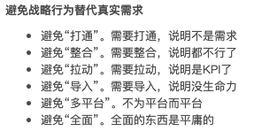

> 写于 2021-06-07。

# 平台产品逻辑与执行

本文要讨论与说明的是：

- 整理：平台产品的基本逻辑与注意点。即**平台产品逻辑、常识**。 如目标、产品关键。
- 避免：忽视平台产品基本逻辑而带来平台产品推动的困境。即**平台产品的执行推动方式**。如对业务的支撑与协同的要求。

> 平台产品 指 如公共设施、移动基础服务。
> 
> 从产品视角，产品/功能 会包含下面几个关注方面：
>
> 1. **产品模型：设计合理性**
>     - **即回答 用户为什么要用产品/功能？**
>     - **是不是** 需求？业务需求的合理性。（这部分本文档暂不讨论）
>     - **能不能 满足需求，可行性下的功能实现程度 是不是够的？**
> 2. **合作模式：收益合理性**
>     - **涉及几方角色；各方的收益、投入/风险是什么，各方能不能配合运作起来（各方的ROI足够）？**
>     - PS：这条本来叫 『商业模式：盈利合理性』；这里讨论平台产品，改写成了『合作模式：收益合理性』
> 3. 环境：拓展合理性（这部分本文档不讨论）
>     - 市场状况拓展性：市场竞争、技术变化、政策影响
>     - 产品逻辑拓展性：能支撑衍生什么功能？
> 4. 团队：实施合理性（这部分本文档不讨论）
>     - 如 执行能力匹配？
>
> PS: 上面的产品关注方面 摘自《[从点子到产品](https://book.douban.com/subject/26927349/)》 CH1 点子到方案

----------------------------------------

<!-- START doctoc generated TOC please keep comment here to allow auto update -->
<!-- DON'T EDIT THIS SECTION, INSTEAD RE-RUN doctoc TO UPDATE -->

- [一、关于 业务产品 vs. 平台产品](#%E4%B8%80%E5%85%B3%E4%BA%8E-%E4%B8%9A%E5%8A%A1%E4%BA%A7%E5%93%81-vs-%E5%B9%B3%E5%8F%B0%E4%BA%A7%E5%93%81)
    - [1.1 业务方引入平台产品的变化](#11-%E4%B8%9A%E5%8A%A1%E6%96%B9%E5%BC%95%E5%85%A5%E5%B9%B3%E5%8F%B0%E4%BA%A7%E5%93%81%E7%9A%84%E5%8F%98%E5%8C%96)
        - [平台产品要担责的约定/范围/条件](#%E5%B9%B3%E5%8F%B0%E4%BA%A7%E5%93%81%E8%A6%81%E6%8B%85%E8%B4%A3%E7%9A%84%E7%BA%A6%E5%AE%9A%E8%8C%83%E5%9B%B4%E6%9D%A1%E4%BB%B6)
    - [1.2 平台应该做什么？](#12-%E5%B9%B3%E5%8F%B0%E5%BA%94%E8%AF%A5%E5%81%9A%E4%BB%80%E4%B9%88)
        - [为什么用 全接管/透明的平台功能来作为平台目标？](#%E4%B8%BA%E4%BB%80%E4%B9%88%E7%94%A8-%E5%85%A8%E6%8E%A5%E7%AE%A1%E9%80%8F%E6%98%8E%E7%9A%84%E5%B9%B3%E5%8F%B0%E5%8A%9F%E8%83%BD%E6%9D%A5%E4%BD%9C%E4%B8%BA%E5%B9%B3%E5%8F%B0%E7%9B%AE%E6%A0%87)
- [二、平台产品对业务的支撑与协同的要求](#%E4%BA%8C%E5%B9%B3%E5%8F%B0%E4%BA%A7%E5%93%81%E5%AF%B9%E4%B8%9A%E5%8A%A1%E7%9A%84%E6%94%AF%E6%92%91%E4%B8%8E%E5%8D%8F%E5%90%8C%E7%9A%84%E8%A6%81%E6%B1%82)
- [三、FaaS透明化运行时升级为例的一些具体讨论](#%E4%B8%89faas%E9%80%8F%E6%98%8E%E5%8C%96%E8%BF%90%E8%A1%8C%E6%97%B6%E5%8D%87%E7%BA%A7%E4%B8%BA%E4%BE%8B%E7%9A%84%E4%B8%80%E4%BA%9B%E5%85%B7%E4%BD%93%E8%AE%A8%E8%AE%BA)
    - [运行时升级 是不是 全接管平台功能（透明的）？](#%E8%BF%90%E8%A1%8C%E6%97%B6%E5%8D%87%E7%BA%A7-%E6%98%AF%E4%B8%8D%E6%98%AF-%E5%85%A8%E6%8E%A5%E7%AE%A1%E5%B9%B3%E5%8F%B0%E5%8A%9F%E8%83%BD%E9%80%8F%E6%98%8E%E7%9A%84)
        - [关于 无人值守的运行时升级](#%E5%85%B3%E4%BA%8E-%E6%97%A0%E4%BA%BA%E5%80%BC%E5%AE%88%E7%9A%84%E8%BF%90%E8%A1%8C%E6%97%B6%E5%8D%87%E7%BA%A7)
    - [关于升级问题的一些业界典型思路与做法](#%E5%85%B3%E4%BA%8E%E5%8D%87%E7%BA%A7%E9%97%AE%E9%A2%98%E7%9A%84%E4%B8%80%E4%BA%9B%E4%B8%9A%E7%95%8C%E5%85%B8%E5%9E%8B%E6%80%9D%E8%B7%AF%E4%B8%8E%E5%81%9A%E6%B3%95)
- [三、产品主题相关资料](#%E4%B8%89%E4%BA%A7%E5%93%81%E4%B8%BB%E9%A2%98%E7%9B%B8%E5%85%B3%E8%B5%84%E6%96%99)
- [PS：一些补充讨论](#ps%E4%B8%80%E4%BA%9B%E8%A1%A5%E5%85%85%E8%AE%A8%E8%AE%BA)

<!-- END doctoc generated TOC please keep comment here to allow auto update -->

----------------------------------------

# 一、关于 业务产品 vs. 平台产品

- **平台产品**
    - 作为业务的支撑角色，完成业务产品中的一部分**通用功能**（即**平台化的功能**）。
    - 与业务产品/同学一起 才能 完成业务价值的交付。
- **业务产品**
    - 对于这部分被平台化的功能，在没有平台产品介入之前，完全由业务自己来支撑，即只有一个负责方。
    - 对于（平台化的）功能所解决的问题，要解决到什么程度 及 问题后果的承担，可以根据业务当前的实际情况阶段，由业务产品/同学自己来动作决策与职责承担。
        - 决策的动作：如 是否升级XXX。
        - 承担的职责：如 升级出了的故障由谁如何承担。
    - 由于动作与担责 是主体是同一个，产品出了问题时 不会出现 模糊不清的跟进与如何担责的扯皮。
- **担责的扯皮 会极度影响平台产品的用户口碑、发展与落地。**
    - 背后的关键 是 
        - **业务对平台产品/功能的要求、产品的SLA 是什么？**
        - **为什么要达到这样的要求？**
    - 值得整理说明清楚，让做平台产品的成员都理解并达成共识，以保证平台产品有效的执行、落地与推动。

## 1.1 业务方引入平台产品的变化

当一个功能 由业务产品自己来承担 迁移到 由平台产品时，会发生一系列的变化。

业务引入一个平台产品后：

- 分离 原来业务自己管理的一部分**功能**到 平台产品中。
- 引入一个新角色 平台方，是一个新的**担责主体**。
    - 当出问题时，业务方就会想：是不是由平台方来担责？

PS： 平台产品的职责还可以进一步分离成 产品实现方 和 产品运维方，本文不再展开。

### 平台产品要担责的约定/范围/条件

平台产品要担责的约定/范围/条件是什么呢？

当符合下面的条件，出的问题由平台产品方来担责：

- 涉及 平台提供/接管的功能
- 平台主动的 平台功能变更/操作 引起  
  即不通知业务、不是业务方触发的，会说成 对于业务的透明的变更/操作。

> 上面的只是 确定由平台担责的那一部分。
> 当条件不这么强时，往往需要Case-By-Case与业务方聊。
>
> TODO 上面条件的描述 需要逐步细化、优化。

上面只是初步的陈述，大家可以来优化这个上面的整理说明。

## 1.2 平台应该做什么？

**长期需要Case-By-Case与业务聊担责的功能，即不能业务透明接管的功能，不合适由平台产品来实现。**

> 这里的**长期**是指：
>
> - 不是 受限于平台的短期节奏/投入，当下还没有去做好的功能；
> - 而是 平台产品解好不可行的功能，比如因为技术不可行等等有核心复杂性，往往业界没有案例无进展。

原因是

- 规模化是平台产品的价值体现的必然路径。
- 而 不业务透明的平台功能 会锁死 平台产品的发展：
    - 人力支撑的一定比例投入，当规模大了，Case-By-Case的支撑 线性消耗了 团队的投入，不具备扩展性。
    - 有一定比例风险，当规模大了，风险量会超出一个平台产品能承担的上限。

接管业务的平台功能做到透明 是指：

- **无需业务团队成员的成本投入**
- **无需业务方承担操作风险**

即 **全接管业务的功能**：

- 是平台的目标；直接体现了平台的核心竞争力。
- 全接管业务的平台功能的多少/比例 可以用来度量 平台的成熟程度。

### 为什么用 全接管/透明的平台功能来作为平台目标？

上面直接关注 **全接管平台功能（透明的）** 的说法 听起来过硬了啊！**部分接管的平台功能（不透明）**，不也能提效业务、也能让平台能有竞争力（相对业务方自己承担）吗？

嗯，上面的思考方式听起来是很自然的；多数人在开始做产品时肯定也是这么想的，并会这样去指导做平台产品的展开。

之所以用**更严格**的『**全接管的平台功能**』来作为平台目标，原因是：

- 用更严格的『全接管/透明的平台功能』，对于产品，表达力可以是一样的。表达转换的方式如下：
    - 对于一个『**部分接管的平台功能**』可以进一步拆解小功能。
    - 其中会包含**全接管的小功能**，就是大功能能提效业务的原因。
- 结合上面『不能业务透明的功能，不合适由平台产品来实现』，实际上
    - 对于『**部分接管的平台功能**』，平台做的是**整合工作**而不是**接管**，并没有规模化的平台产品价值；
    - 平台产品会做这样的整合工作，是为了透出『**全接管的平台功能**』的平台价值，吸引用户来用。
- 且 这样更严格的方式 能
    - 能简单有效地判断 产品的成熟程度/竞争力。
    - 也能更好引导 每个做产品的同学积极发现 平台产品发展的关键点。

> 上面关于『**平台功能的全接管**』回答了上面的『担责扯皮』背后的关键：
>
> - **业务对平台产品/功能的要求、产品的SLA 是什么？**
> - **为什么要达到这样的要求？**

总结上面所说的成一句话：
在平台产品功能中，要区分 哪些是接管的功能，哪些是整合的功能。

# 二、平台产品对业务的支撑与协同的要求

- 在平台产品功能中，要区分 哪些是接管的功能，哪些是整合的功能。
    - **对于一个平台功能的实现程度 是可以分级；一个平台功能可以再分拆来看。**
    - 比如 FaaS平台的运行时升级：
        - 如果FaaS运行时升级 不是 接管透明（不能可靠保证升级后业务没有问题）。
        - 但其中 升级的执行过程/步骤 这个子功能 平台可以做到接管透明，可以提效业务。
- 对于平台关键的『**全接管透明功能**』：
    - **无需业务团队成员的成本投入、无需业务方承担操作风险；引发的问题由平台担责。**
    - **对于全接管的功能，要承担风险，也获得对应的KPI。平台方不能有给予者心态。**
    - 比如 FaaS平台的运行时升级 不能要求 业务先保证提供完备的业务测试Case。
        - 平台产品并不是救人危难的给予者，只不过是业务使用一个组件，也收获了平台自己的KPI。
        - 像平台触发的变更，但要求业务有完整Case，背后隐含了给予心态，对业务提非分要求（业务监控要完整 ）。假想一下：
            - 你是业务，业务监控/回归Case多点少点，我自己兜风险、看投入与节奏、看团队成员水平，不能保证完备。
            - FaaS自己的监控敢说完整不? k8s 变更 对FaaS提监控/回归Case要完备的要求？
- 对于平台上部分接管的整合功能：
    - **明确说明 业务要关注的事项，哪些问题平台不能担责，避免担责扯皮。**

# 三、FaaS透明化运行时升级为例的一些具体讨论

> TODO
>
> 下面具体『透明化运行时升级』Case的讨论，与 上面泛化的平台产品的思考  
> 还要互相对照 的 梳理整理……

## 运行时升级 是不是 全接管平台功能（透明的）？

上面一节提到的是 功能能否 全接管/透明 是平台产品发展与竞争力的关键，是关于平台产品功能的前提关键问题。

**不能做到 透明化运行时升级。** 这个判断，原因如下：

1. 如果 依赖了 涉及业务同学的功能回归，才能保证升级稳定性，则不是透明的（不是一个平台化功能）：
    - 涉及业务功能的回归，而 回归业务是个业界难题，判断**长期不可能透明解决**。
    - 业务的 回归Case 与 监控指标，一定不能 保证回归就是安全的。
        - 因为故障原因 五花八门，回归Case、业务指标再多，也不能保证发现问题。
        - **像 软件无bug、监控无死角，都只是理想。**
    - 业务自己回归的执行方式：
        - 功能回归会有人肉业务测试；（自动化）业务回归case往往不多、更不能说完整。
        - 业务同学 Case-By-Case结合业务当下的实际情况，来确定 回归的执行程度。
    - 即 回归业务 需要业务方参与，不能透明。
2. FaaS平台的运行时升级 不能要求 业务先保证提供完备的业务测试Case。
    - 接了活 就要承担风险，平台并不是救人危难的给予者，只不过是业务 使用一个组件，也收获了平台自己的KPI。
        - 像平台触发的变更，但要求业务有完整Case，背后隐含了给予心态，对业务提非分要求（业务监控要完整 ）。
        - 假想一下：
            - 你是业务，业务监控/回归Case多点少点，我自己兜风险、看投入与节奏、看团队成员水平，不能保证完备。
            - FaaS自己的监控敢说完整不? k8s 变更 对FaaS提监控/回归Case要完备的要求？
    - 不管是为了平台、还是为了业务，动了都是变更。
    - 只要是平台的变更引起的，故障是平台的。
        - Noah变更/升级有问题，业务故障算Noah的。
        - FaaS运行时透明升级有问题，业务故障算FaaS的。
    - FaaS不能对业务的监控完备提要求。平台的变更是平台的锅，别问业务指标够不够。
        - 这是业务方的自然心态；也是对平台方的要求。
        - 否则出了故障，就会出现下面的局面：
            - 平台方觉得，业务同学不体量
            - 业务方觉得，平台同学想的太简单、不厚道

### 关于 无人值守的运行时升级

- 是否『无人值守』是在说明提效方式，没有说明『为什么 升级的回归是可靠的？』。
- 说明提效/无人前，先要说明是否可靠/稳，不是 过渡不过渡方案的问题。

## 关于升级问题的一些业界典型思路与做法

- 应用的依赖升级 是 业务应用变更，不是平台变更。
    - 大家有了共识，边界清楚
    - 可执行：业务自己来执行回归；避开了『业务方来做业务回归/保证稳』这个不可能完成的任务
- 运行时有多个版本又会怎样? 真是问题吗？
    - 不要简单过快回答。
    - 上面的讨论说明，另一面的路(由业务保证回归 & 统一升级 的方式)，在产品逻辑上不可行。
- 问题：业务没有升级，出了平台老bug。如何解决定责？
    - 对 长时间组件老版本/有问题的组件版本
        - 发出升级公告、邮件群发
        - 说明 组件问题、平台免责。强调风险和后果要自负。
        - 这就是像`FastJson`这样基础组件平时的做法。
    - 上面是关于平台组件升级，业界的典型做法与出路；一般称为『夕阳条款』。
    - 平台不可能无限期支持老组件与组件老版本，所以有『夕阳条款』是合理的。

# 三、产品主题相关资料

- 微信之父张小龙内部100多页PPT，全面剖析微信背后的产品观
    - 文字版 [https://www.cnblogs.com/end/p/5521138.html](https://www.cnblogs.com/end/p/5521138.html) 、[文字版2](https://www.vshouce.com/wechat-ppt.html)；[PPT图片版](https://www.163.com/dy/article/FQ230RUA051998SC.html)
    -   
    作为可能的注意项 看看/想想，挺有用有意思的

# PS：一些补充讨论

业务回归测试也是一种手段，更原始的需求或许是：发布期间的异常检测。

从『透明化运行时升级』功能/需求的涉及的『业务回归测试』 到 『发布异常检测』功能/需求，  
**是对于用户/业务需求、产品功能的一次思考、演进与变化：更加确定 实现功能及其程度是业务需要的。**

下面展开一些的具体讨论：

> 展开讨论 是想再次表达本文档目标，即
>
> - 关键前提的产品逻辑 值得先想清楚、反复思辨深入 （虽然是分析的事都只是像在纸上谈兵、 沙盘推演）。
> - 避免投入后回头才发现因产品逻辑不对不能期望地透出产品价值，成本相比就高得去了。

像『发布异常检测』这样的功能

- 可以逐步提升的检测宽度与有效性
- 对用户/业务是 好的加分项
- 如果接入成本低，业务会积极用上
- 比较没 故障的担责风险（具体还要看这个功能的做的程度与SLA）

初步看起来，做这个功能必要&可能。也相信这个功能做精，本身就可以很有竞争力。

像『发布异常检测』这样的技术建设会有很多，可能比较分散，可能可以有机的结合起来。整合也不是个简单的事：

- 相信心底里大家不喜欢用『整合』这个词，总是个二等公民。😬
- 对一个『整合』的理解/探索到位了，『整合』
    - 会变成一个新能力
    - 或 孵化出/发现 一个被忽视的关键的新能力
- 这个新能力 会成为 产品的Core。

**我们能不能清楚表达描述 这个现在还不存在的新能力，或许可以用来判断 我们的产品逻辑/理解 是不是清楚了。**

但如果要执行投入，还可以要问下面的问题：

- 这个功能做了业务用户喜欢/主动要来用，功能实现程度的拐点是什么？  
    即产品功能的爆点 觉得 会在哪儿？
- 这么明显的诉求，相信大家（无论是业务团队/还是平台团队）不难想到。那么
    - 这个能力 业界做的如何？
    - 旁边可以用的对应产品是哪些？做如何？用户用的如何？
    - 为什么对于这个明显诉求的能力，平时好像没有听到过？
        - 是因为已有的做得不好？这个功能做到有用程度不可行？
        - 还是做的太好了？（应该并不是这个原因 :"）我们做 是不是没什么空间了？
- ……

大家在论证产品逻辑时，会出现这样的逻辑：

> - 退化为：运行时升级（通知）工具。我们或许短期需要这样的“工具”，但长期一定不是的。
>     - 这样的工具，其实解决问题提很有限，因为真正耗费「开发者」精力的部分是观察和测试。
> - 而且规模化之后统一升级的负面影响更大：
>     - 规模化之后平台产品团队很快会成为资源瓶颈，到时候如果没有真正的科技进步，就必须开倒车：把控制权再次交还给「业务开发人员」。

上面的『长期一定不是的』这样的结论/观点，像是在表达是在表达『愿望』，而不逻辑。😄  
说明了『运行时升级（通知）工具』的做法会有发展限制问题，但并没有说明 与对工具对应的平台做法 可行。

『A不行』并不能推出『在A对面的B就可行是方向』。  
即 排除法 对于不确定的规划的事 是不适用的，因为 事情是不是有解/整体组合功能是不是能发展出来 还是未知的。

产品逻辑 推演要包含给出 如何『做成』一个产品（可行性），而不仅是给出 为什么要『要做』一个产品（有需求）。

像下面这样的逻辑说明：

> - 运行时升级工具（集中式）是需要耗费FaaS产品的人力进行对齐的（平台方式是必要的）……
> - 如果没有真正的科技进步，就必须开倒车。……

说明的是工具做法的问题，逻辑是在说明 平台必要性，即论证的是 为什么我们要平台做法。
对于产品逻辑的目标 平台做法能『做成』并没有说明。

值得被充分展开说明，做产品的同学们能有传达思考与理解。

> 的确是这样的，bug出其不意、错误五花八门，指标再多也会漏，但人同样不能保证。
>
> 同时人能保证的那部分一定可以转化为规则或标准，通过自动化执行规则大概率比人执行的好。

会越来越规则化/标准化 、 比人肉好更有效 、提效，我也是赞成的。

当然，平台+规范可以让测试更全面。一定程度上也是倒逼更好的编码风格。

『倒逼更好的编码风格』这样的事想想了意思一下就好～ 🤤 对于做一个产品就别当真了。  
（即不能是做成的产品的前提，也不要让产品多个无助成功但分散投入的目标。）
